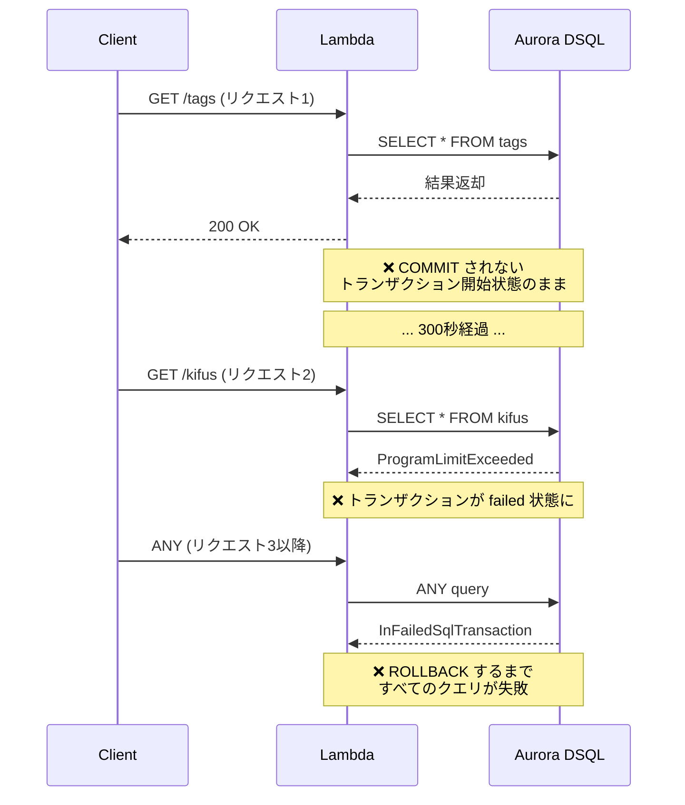

# BUG-001: Aurora DSQL トランザクションタイムアウトによる 500 エラー

## ステータス

修正済み（2026-03-09）

## 採用した修正案

案1: `autocommit=True` に変更。

- `repositories/db.py`: `autocommit=False` → `autocommit=True`
- `repositories/tag_repository.py`: 書き込み系メソッド（insert_tag, update_tag, delete_tag）の `conn.commit()` → `with conn.transaction():` ブロック
- `repositories/kifu_repository.py`: 書き込み系メソッド（insert_kifu, update_kifu, delete_kifu, insert_kifu_tags, delete_kifu_tags）の `conn.commit()` → `with conn.transaction():` ブロック
- `services/user_service.py`: `delete_account` の `conn.commit()` → `with conn.transaction():` ブロック

読み取り系クエリはトランザクションを開始しなくなり、書き込み系は `conn.transaction()` コンテキストマネージャで明示的に管理する。

## 発見日

2026-03-09

## 概要

Lambda 上で Aurora DSQL への SELECT クエリがトランザクションをコミットせずに放置するため、300秒のトランザクション寿命制限に達し、以降のすべてのクエリが失敗する。

## 症状

- API が断続的に 500 エラーを返す
- 一度エラーが発生すると、同一 Lambda インスタンスからの後続リクエストがすべて失敗する
- Lambda のコールドスタート（新しいインスタンス）では一時的に復旧する

## CloudWatch ログの証跡

30分間で **74件** のエラーを確認:

### 根本原因エラー（1件）

```
ProgramLimitExceeded: transaction age limit of 300s exceeded
```

### 連鎖エラー（73件）

```
InFailedSqlTransaction: current transaction is aborted, commands ignored until end of transaction block
```

## 根本原因

`Backend/main/src/repositories/db.py` のコネクション管理に問題がある。

```python
_conn: psycopg.Connection | None = None

def get_connection() -> psycopg.Connection:
  global _conn
  if _conn is None or _conn.closed:
    from aurora_dsql_psycopg import DSQLConnection
    _conn = DSQLConnection.connect(
      DSQL_CLUSTER_ENDPOINT,
      autocommit=False,  # ← トランザクションが自動コミットされない
      row_factory=dict_row,
    )
  return _conn
```

### 問題の連鎖



### 要因の整理

1. **`autocommit=False`**: psycopg はデフォルトでトランザクション内で動作し、明示的な `commit()` または `rollback()` が必要
2. **モジュールレベルのコネクション再利用**: `_conn` が Lambda のウォームスタート間で共有され、前回のトランザクション状態が引き継がれる
3. **SELECT 後の `commit()` 漏れ**: 読み取り専用クエリでもトランザクションを閉じる必要がある
4. **Aurora DSQL の 300秒制限**: 一般的な PostgreSQL にはないトランザクション寿命の上限がある

## 影響範囲

- `tag_repository.list_tags()` — SELECT のみでコミットなし
- `kifu_repository` の読み取り系メソッド — 同様
- その他すべての SELECT のみで完結するリポジトリメソッド

## 修正案

### 案1: `autocommit=True` に変更（推奨）

```python
_conn = DSQLConnection.connect(
  DSQL_CLUSTER_ENDPOINT,
  autocommit=True,
  row_factory=dict_row,
)
```

書き込み操作のみ `with conn.transaction():` ブロックで明示的にトランザクションを管理する。

### 案2: 各リポジトリで `commit()` を追加

読み取り操作後にも `conn.commit()` を呼ぶ。ただし漏れのリスクが高い。

### 案3: コネクションのトランザクション状態チェックを追加

`get_connection()` でトランザクション状態を確認し、failed 状態なら `rollback()` してから返す。

```python
def get_connection() -> psycopg.Connection:
  global _conn
  if _conn is None or _conn.closed:
    _conn = DSQLConnection.connect(...)
  elif _conn.info.transaction_status == psycopg.pq.TransactionStatus.INERROR:
    _conn.rollback()
  return _conn
```

## 再現手順

1. Lambda インスタンスがウォームな状態で GET リクエストを送る
2. 300秒以上待つ
3. 再度リクエストを送ると 500 エラーが返る
4. 以降、そのインスタンスへのリクエストはすべて 500 エラーになる

## 関連

- [Aurora DSQL のトランザクション制限](https://docs.aws.amazon.com/aurora-dsql/latest/userguide/working-with-transactions.html)
- psycopg ドキュメント: [Transaction management](https://www.psycopg.org/psycopg3/docs/basic/transactions.html)
