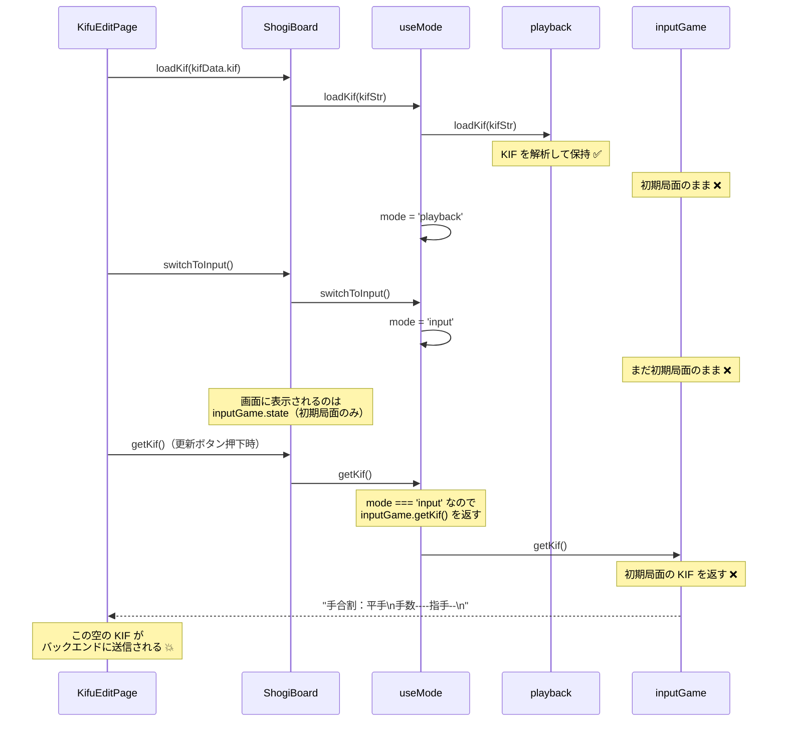

# BUG-002: 棋譜編集画面で将棋盤入力モードに切り替えると棋譜データが消失する

## ステータス

未修正

## 発見日

2026-03-09

## 概要

棋譜編集画面（KifuEditPage）で、棋譜入力方式を「将棋盤」にすると、読み込んだ棋譜の指し手が将棋盤に反映されず初期局面のみが表示される。この状態で「更新」ボタンを押すと、初期局面のみの KIF がバックエンドに送信され、既存の棋譜データが上書き・消失する。

## 再現手順

1. 棋譜を作成する（手数のある KIF データを含む）
2. 棋譜詳細ページから「編集」ボタンをクリック
3. 棋譜編集ページが開く（デフォルトで「将棋盤」入力モード）
4. 将棋盤には初期局面のみが表示され、既存の指し手が反映されていない
5. そのまま「更新」ボタンをクリック
6. 棋譜データが初期局面のみで上書きされ、元の指し手がすべて消失する

## 根本原因

### 問題箇所: `useMode.ts` の `loadKif()` と `switchToInput()` の相互作用

`KifuEditPage.vue` の `onMounted()` で以下の順序で呼び出しが行われる:

```typescript
// KifuEditPage.vue:78-84
boardRef.value?.loadKif(kifuData.kif)   // ① playback に KIF を読み込む
boardRef.value?.switchToInput()          // ② input モードに切り替える
```

しかし、`useMode.ts` の実装では:

```typescript
// useMode.ts:121-125
function loadKif(kifStr: string) {
  playback.loadKif(kifStr)   // playback にのみ KIF を読み込む
  mode.value = 'playback'    // モードを playback に変更
  clearSelection()
}

// useMode.ts:67-70
function switchToInput() {
  mode.value = 'input'       // モードを input に変更するだけ
  clearSelection()
}
```

**問題の本質**: `loadKif()` は `playback`（再生用ゲーム状態）にのみ KIF を読み込む。その後 `switchToInput()` でモードを `input` に切り替えても、`inputGame`（入力用ゲーム状態）には KIF データが反映されない。`inputGame` は `createInitialState()`（初期局面）のままである。

### データフロー図



### 二重バッファ構造

`useMode.ts` は `inputGame` と `playback` を完全に分離した状態で管理している:

| 状態管理 | 役割 | KIF 読み込み |
|----------|------|-------------|
| `inputGame` (useGameState) | input モードの盤面・操作 | ❌ 未反映 |
| `playback` (usePlayback) | playback モードの盤面・再生 | ✅ 反映済み |

`getKif()` はモードに応じて異なるゲーム状態から KIF を取得する:

```typescript
// useMode.ts:113-119
function getKif(): string {
  if (mode.value === 'input') {
    return inputGame.getKif()    // ← input モードではここが呼ばれる
  }
  return playback.getKif()
}
```

### 棋譜作成ページ（KifuCreatePage）との違い

棋譜作成ページでは最初から `inputGame` に対して手を入力していくため、この問題は発生しない。問題は **既存の KIF を読み込んで編集する** ケースに限定される。

## 影響範囲

- `Frontend/shogi-main/src/pages/KifuEditPage.vue` — 棋譜編集ページ
- `Frontend/shogi-board/src/composables/useMode.ts` — `loadKif()` / `switchToInput()`
- `Frontend/shogi-board/src/composables/useGameState.ts` — `inputGame`（loadKif メソッドは存在するが呼ばれていない）
- `Frontend/shogi-board/src/composables/usePlayback.ts` — `playback`

## ユーザーストーリーとの関係

### US-3.6: 棋譜の編集

> - 既存のデータ（スラグ、先後、勝敗、タグ、メモ、共有、**棋譜データ**）がフォームにプリロードされる
> - 各項目を変更して「更新」ボタンで保存できる

**現状**: 将棋盤入力モードでは棋譜データがプリロードされない（受け入れ条件を満たしていない）。

### US-3.3: 棋譜の将棋盤 GUI 入力

> - **棋譜作成・編集ページ**で「将棋盤」入力モードを選択できる

**現状**: 作成ページでは正常に動作するが、編集ページでは既存 KIF が input モードに反映されないため、実質的に編集ページでの将棋盤入力モードは機能していない。

### user_stories.md の更新要否

現在の US-3.6 の受け入れ条件は「棋譜データがフォームにプリロードされる」と記述しており、将棋盤入力モードでの棋譜プリロードも暗黙的にカバーしている。ただし、以下の明確化を推奨する:

- **将棋盤入力モードでの棋譜プリロード**: 将棋盤モードでも既存の指し手が盤面に反映された状態で表示されること
- **入力モード切替時のデータ保持**: テキスト ↔ 将棋盤の切替時にデータが失われないこと

## 関連する問題

### 問題 A: 棋譜データが inputGame に反映されない（本バグの核心）

上記「根本原因」セクション参照。

### 問題 B: input モードに「一手戻す」UI がない

`useGameState.ts` に `doUndo()` ロジックは実装済みで、`useMode.ts` も input モード時の undo をサポートしている。しかし、`ShogiBoard.vue` のテンプレートでは `PlaybackControls`（一手戻すボタンを含む）が `mode === 'playback' || mode === 'continuation'` のときにのみ表示され、**input モードでは一手戻すボタンが存在しない**。

```vue
<!-- ShogiBoard.vue:117-130 -->
<PlaybackControls
  v-if="mode === 'playback' || mode === 'continuation'"  <!-- input モードでは非表示 -->
  ...
/>
```

これにより、入力ミスをした場合に修正する手段がない。特に編集モードで既存棋譜を読み込んだ後、末尾の手を取り消すことが不可能である。

### 問題 C: 編集モードで「変更を破棄して復元」する手段がない

編集中に誤った操作を行った場合、保存前に元の棋譜データに戻す手段が存在しない。KifuEditPage には「キャンセル」ボタンがあるが、これは `router.back()` でページ遷移するだけであり、将棋盤上の状態を元に戻す機能ではない。

## 修正案

### 修正 1: `useMode.ts` の `loadKif()` を修正して `inputGame` にも読み込む

```typescript
function loadKif(kifStr: string) {
  playback.loadKif(kifStr)
  inputGame.loadKif(kifStr)   // ← 追加: inputGame にも読み込む
  mode.value = 'playback'
  clearSelection()
}
```

`inputGame.loadKif()` → `parseKif()` は KIF を全手解析し、history 付きの最終局面 state を返す。そのため `doUndo()` で手を戻すことも可能。

### 修正 2: input モードに「一手戻す」ボタンを追加

ShogiBoard.vue に input モード用のコントロールを追加し、`doUndo()` を呼び出せるようにする。

考えられる実装:
- `PlaybackControls` に input モードの表示パターンを追加する
- または、input モード専用の `InputControls` コンポーネントを新設する

input モードのコントロールには最低限以下が必要:
- **一手戻す**ボタン（`doUndo()`）
- **リセット**ボタン（`reset()` — 初期局面に戻す）

### 修正 3: 編集ページに「変更を破棄」ボタンを追加

KifuEditPage に、将棋盤の状態を保存済みの KIF に復元するボタンを追加する。

```typescript
function handleRestore() {
  if (kifu.value?.kif) {
    boardRef.value?.loadKif(kifu.value.kif)
    boardRef.value?.switchToInput()
    kifText.value = kifu.value.kif
  }
}
```

テンプレートには確認ダイアログ付きのボタンを設置する。

### 修正の優先度

| 優先度 | 修正 | 理由 |
|--------|------|------|
| **高** | 修正 1: inputGame への KIF 読み込み | データ消失を防ぐ最優先の修正 |
| **高** | 修正 2: input モードの一手戻す UI | 入力ミス修正ができないと実用に耐えない |
| **中** | 修正 3: 変更を破棄ボタン | 編集作業の安全網として重要 |

## user_stories.md の更新案

### US-3.3 に追加すべき受け入れ条件

- input モードで「一手戻す」操作ができる（入力ミスの修正が可能）
- input モードで「リセット」操作ができる（初期局面に戻せる）

### US-3.6 に追加すべき受け入れ条件

- 将棋盤入力モードでも既存の棋譜データ（指し手）が盤面にプリロードされ、最終局面が表示される
- 編集中に「変更を破棄」操作で保存済みの棋譜を復元できる
- 入力モード切替（テキスト ↔ 将棋盤）時にデータが失われない

## 追加考慮事項

### テキスト ↔ 将棋盤モード切替時のデータ同期

現状、テキストモードで KIF を編集した後に将棋盤モードに切り替えても、テキストの変更は将棋盤に反映されない（逆も同様）。これは本バグとは別の課題だが、関連する UX 問題として認識しておくべきである。

## 関連ファイル

| ファイル | 説明 |
|---------|------|
| `Frontend/shogi-main/src/pages/KifuEditPage.vue` | 棋譜編集ページ |
| `Frontend/shogi-main/src/pages/KifuCreatePage.vue` | 棋譜作成ページ（参考: 正常動作） |
| `Frontend/shogi-board/src/composables/useMode.ts` | モード管理（loadKif/switchToInput） |
| `Frontend/shogi-board/src/composables/useGameState.ts` | 入力用ゲーム状態 |
| `Frontend/shogi-board/src/composables/usePlayback.ts` | 再生用ゲーム状態 |
| `Frontend/shogi-board/src/components/ShogiBoard.vue` | 将棋盤コンポーネント |
| `Frontend/shogi-board/src/core/kif.ts` | KIF 解析・生成 |
| `docs/user_stories.md` | ユーザーストーリー（US-3.3, US-3.6） |
