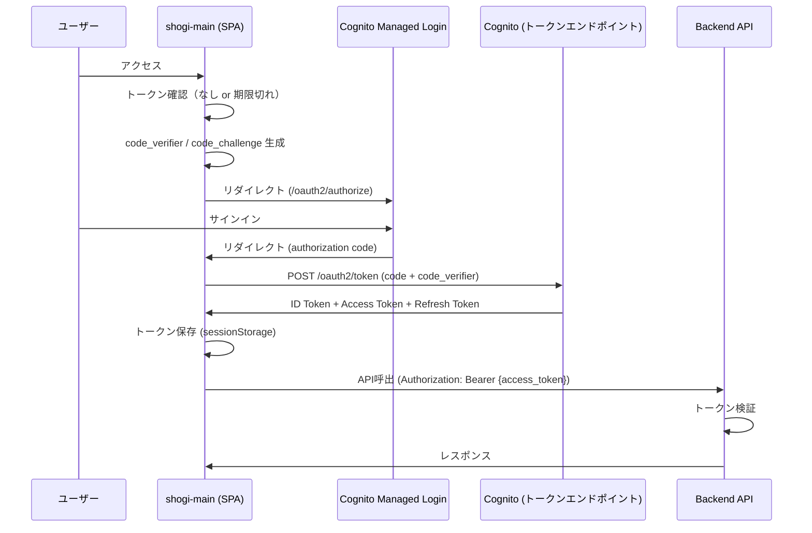

# 認証設計書

Amazon Cognito Managed Login を利用した認証フローの設計を定義する。

---

## 1. 方針

### 1.1 Managed Login の採用

Cognito の **Managed Login** （マネージドログインページ）を採用する。
SPA側にカスタムログインフォームは作成せず、Cognitoが提供するログイン画面にリダイレクトする方式とする。

**採用理由:**

- サインアップ / サインイン / パスワードリセット / MFA を Cognito 側で完結できる
- 日本語ローカライゼーション対応（`lang=ja`）
- ブランディングエディタによるノーコードカスタマイズ
- Authorization Code + PKCE フロー対応（SPA推奨）
- カスタムログインフォームの開発・保守コストを削減

### 1.2 Cognito プラン

**Essentials** プランを使用する。

| プラン | 料金 | Managed Login | パスワードレス | MFA (Email) |
|--------|------|:---:|:---:|:---:|
| Lite | $0.0055/MAU | - | - | - |
| **Essentials** | **$0.015/MAU** | **○** | **○** | **○** |
| Plus | $0.020/MAU | ○ | ○ | ○ |

- 10,000 MAU/月まで無料
- 本アプリの想定規模では無料枠内で運用可能

### 1.3 SDK

Amplify は使用せず、**oidc-client-ts** を利用する。

| ライブラリ | 用途 |
|-----------|------|
| [oidc-client-ts](https://github.com/authts/oidc-client-ts) | OIDC クライアント（PKCE、トークン管理、サイレント更新） |

**Amplify を採用しない理由:**

- Amplify はフルスタックフレームワークであり、認証のみに使うにはオーバースペック
- oidc-client-ts は標準的な OIDC ライブラリであり、Cognito 固有の依存を最小化できる
- TypeScript フルサポート、軽量

---

## 2. 認証フロー

### 2.1 全体フロー

Authorization Code Grant + PKCE を使用する。



### 2.2 認可リクエスト

```
GET https://{domain}.auth.{region}.amazoncognito.com/oauth2/authorize
  ?response_type=code
  &client_id={app_client_id}
  &redirect_uri={callback_url}
  &code_challenge={code_challenge}
  &code_challenge_method=S256
  &scope=openid email profile
  &lang=ja
```

### 2.3 トークン交換

```
POST https://{domain}.auth.{region}.amazoncognito.com/oauth2/token
Content-Type: application/x-www-form-urlencoded

grant_type=authorization_code
&client_id={app_client_id}
&redirect_uri={callback_url}
&code={authorization_code}
&code_verifier={code_verifier}
```

### 2.4 トークンの保管

| トークン | 保管場所 | 用途 |
|---------|---------|------|
| ID Token | sessionStorage | ユーザー情報の表示 |
| Access Token | sessionStorage | API 呼出時の認証ヘッダー |
| Refresh Token | sessionStorage | トークンの自動更新 |

> sessionStorage を使用する理由: タブ間でセッションを共有する必要がなく、
> タブを閉じた時点でトークンが消去されるため、localStorage より安全。

---

## 3. SPA 側の実装方針

### 3.1 oidc-client-ts 設定

```typescript
import { UserManager, WebStorageStateStore } from 'oidc-client-ts'

const userManager = new UserManager({
  authority: 'https://cognito-idp.{region}.amazonaws.com/{userPoolId}',
  client_id: '{appClientId}',
  redirect_uri: '{origin}/callback',
  post_logout_redirect_uri: '{origin}/',
  response_type: 'code',
  scope: 'openid email profile',
  userStore: new WebStorageStateStore({ store: window.sessionStorage }),
  metadata: {
    end_session_endpoint:
      'https://{domain}.auth.{region}.amazoncognito.com/logout',
  },
})
```

### 3.2 ルーティング

| パス | 用途 |
|------|------|
| `/callback` | Cognito からのリダイレクト受信。authorization code からトークンを取得 |
| `/` | 未認証時は Managed Login へリダイレクト |

### 3.3 API 呼出時のトークン付与

```typescript
const user = await userManager.getUser()
if (user && !user.expired) {
  headers['Authorization'] = `Bearer ${user.access_token}`
}
```

### 3.4 サイレントトークン更新

oidc-client-ts の `automaticSilentRenew` を有効にし、Access Token の期限切れ前に Refresh Token でトークンを自動更新する。

---

## 4. Backend 側のトークン検証

API Gateway の Cognito Authorizer、または Lambda 内での JWT 検証で Access Token を検証する。

**検証項目:**

1. JWT 署名の検証（Cognito の JWKS エンドポイントから公開鍵を取得）
2. `iss` (issuer) が `https://cognito-idp.{region}.amazonaws.com/{userPoolId}` と一致
3. `token_use` が `access` であること
4. `exp` (有効期限) が現在時刻より未来であること
5. `client_id` が期待するアプリクライアントIDと一致

**ユーザー識別:**

- `cognito:username` (sub) をユーザーの一意識別子として使用する
- API Gateway の Cognito Authorizer 使用時は `event.requestContext.authorizer.claims` から取得

---

## 5. Cognito User Pool 設定

### 5.1 アプリクライアント

| 設定項目 | 値 |
|---------|------|
| クライアントシークレット | なし（パブリッククライアント） |
| 認証フロー | ALLOW_USER_AUTH |
| OAuth 2.0 Grant Types | Authorization Code Grant |
| OAuth 2.0 Scopes | openid, email, profile |
| Callback URL | `https://{domain}/callback` |
| Sign-out URL | `https://{domain}/` |

### 5.2 Managed Login ブランディング

| 設定項目 | 値 |
|---------|------|
| 表示モード | ブラウザ適応（ライト/ダーク自動切替） |
| ロゴ | 将棋アプリのロゴ |
| 言語 | ja（日本語） |

---

## 6. Managed Login の制約事項

| 制約 | 影響と対応 |
|------|-----------|
| プロファイル管理機能なし | ユーザー属性変更（表示名等）は SPA 側で Cognito API を直接呼出して実装 |
| カスタム認証チャレンジ Lambda 非対応 | 標準の認証方式（パスワード、MFA）のみ使用。問題なし |
| テキスト文言のカスタマイズ不可 | ローカライゼーション（`lang=ja`）で対応 |
| セッション Cookie は1時間固定 | Refresh Token によるトークン更新で対応 |
| HTTPS 必須 | 開発時は `http://localhost` が例外として許可される |

---

## 7. 関連ドキュメント

| ドキュメント | 内容 |
|-------------|------|
| [requirements.md](requirements.md) | 要件定義書（認証要件は 2.2 / 3.1） |
| [api-design.md](api-design.md) | API設計書（認証ヘッダー仕様） |
| [project-structure.md](project-structure.md) | プロジェクト構成（shogi-main の auth/ ディレクトリ） |

### 参考リンク

- [Amazon Cognito Managed Login](https://docs.aws.amazon.com/cognito/latest/developerguide/cognito-user-pools-managed-login.html)
- [Authorization Code Grant + PKCE](https://docs.aws.amazon.com/cognito/latest/developerguide/using-pkce-in-authorization-code.html)
- [Cognito Pricing](https://aws.amazon.com/cognito/pricing/)
- [oidc-client-ts](https://github.com/authts/oidc-client-ts)
