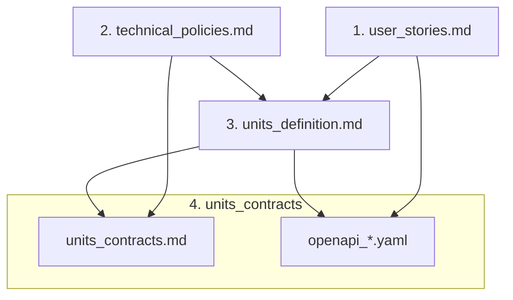

# ドキュメント作成フロー

## 概要

本プロジェクトのドキュメントは以下の順序で段階的に作成する。各ステップの成果物が次のステップの入力となる。

## フロー

### 1. ユーザーストーリーの定義 (`user_stories.md`)

- アクターの定義
- ユーザーストーリーの列挙
- 受け入れ条件の記述

### 2. 技術方針の定義 (`technical_policies.md`)

- レイヤーの責務（フロントエンド・バックエンド・インフラ・CI/CD）
- スタック構成とデプロイ順序
- マイクロサービスの追加規約

> このドキュメントはプロジェクト固有ではなく、同様のアーキテクチャを採用するプロジェクトで共通して利用できる。

### 3. 開発ユニット分割 (`units_definition.md`)

**入力**: `user_stories.md`, `technical_policies.md`

- バックエンドをいくつのマイクロサービスに分割するかを決定する
- 各ユニット（フロントエンド・各バックエンド・インフラ・CI/CD）の責務を定義する
- ユーザーストーリーと各ユニットの対応を整理する

### 4. ユニット間の契約 (`units_contracts.md`)

**入力**: `technical_policies.md`, `units_definition.md`

- CloudFormation エクスポート/インポートの具体的な定義
- バックエンド間連携の方針
  - 連携方式（同期 / 非同期）
  - 認証情報の扱い方

### 5. OpenAPI 定義 (`openapi_*.yaml`)

**入力**: `user_stories.md`, `units_definition.md`

- 各バックエンドの API を OpenAPI 仕様で詳細に定義する
- リクエストボディ、レスポンス、エラーの型定義
- パスパラメータ、クエリパラメータの定義
- マイクロサービスごとに `openapi_*.yaml` として作成する
- 作成にあたっては、まず `_api_list.md` としてエンドポイント一覧（パス・メソッド・認証要否）を一時ファイルで作成し、人がレビュー・承認した後に OpenAPI 定義に落とし込む。`_api_list.md` は一時的なものであり、将来の仕様変更時には更新しない

## 現在の状況

| ステップ | ファイル | 状態 |
|---------|---------|------|
| 1 | `user_stories.md` | 完了 |
| 2 | `technical_policies.md` | 完了 |
| 3 | `units_definition.md` | 完了 |
| 4 | `units_contracts.md` | 完了 |
| 5 | `openapi_*.yaml` | 未着手 |
