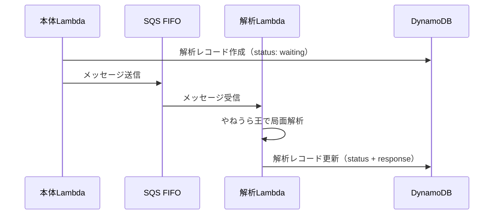

# 解析Lambda インターフェース定義書

解析Lambda（コンテナイメージ）と本体アプリケーション間のデータ受け渡しを定義する。

---

## 1. 全体フロー



解析Lambdaは **SQSメッセージを入力**、**DynamoDB書き込みを出力** とする。本体Lambdaとの直接的な通信はない。

---

## 2. 入力: SQSメッセージ

### メッセージ形式

SQSメッセージの `body` にJSON文字列として格納される。

```json
{
  "username": "hakira",
  "aid": "aNaLySiS12345",
  "position": "lnsgkgsnl/1r5b1/ppppppppp/9/9/9/PPPPPPPPP/1B5R1/LNSGKGSNL b - 1",
  "movetime": 3000
}
```

| フィールド | 型 | 必須 | 説明 |
|-----------|------|------|------|
| `username` | string | 要 | リクエストしたユーザー名 |
| `aid` | string | 要 | 解析ID（DynamoDB更新時のキーに使用） |
| `position` | string | 要 | SFEN形式の局面文字列（`position sfen`プレフィックスなし） |
| `movetime` | integer | - | 思考時間（ミリ秒）。`3000` / `5000` / `10000`。デフォルト: `3000` |

### position の形式

SFEN形式。4つのフィールドをスペース区切り。

```
lnsgkgsnl/1r5b1/ppppppppp/9/9/9/PPPPPPPPP/1B5R1/LNSGKGSNL b - 1
^^^^^^^^^^^^^^^^^^^^^^^^^^^^^^^^^^^^^^^^^^^^^^^^^^^^^^^^^ ^ ^ ^
盤面                                                     手番 持駒 手数
```

| フィールド | 説明 | 例 |
|-----------|------|-----|
| 盤面 | 9段を `/` で区切り、先手は大文字、後手は小文字。成駒は `+` 付き | `lnsgkgsnl/...` |
| 手番 | `b`（先手）/ `w`（後手） | `b` |
| 持駒 | なし: `-`、あり: `2P3p` 等（大文字=先手、小文字=後手、数字=枚数） | `-` |
| 手数 | 1始まりの整数 | `1` |

### SQSキュー設定

| 項目 | 値 |
|------|-----|
| キュータイプ | FIFO |
| メッセージグループID | `analysis` |
| 重複排除 | コンテンツベース |

---

## 3. 出力: DynamoDB更新

解析Lambdaは結果をDynamoDBに直接書き込む。

### 更新対象

| 属性 | 値 |
|------|-----|
| テーブル | `table-sgp-pro-main`（環境変数 `DYNAMODB_TABLE` で指定） |
| PK | `analysis` |
| SK | `aid#{aid}` |

### 更新フィールド

| フィールド | 型 | 説明 |
|-----------|------|------|
| `status` | string | `"successed"` or `"failed"` |
| `response` | string | JSON文字列（下記参照） |

### response の構造

`response` はJSON文字列として格納される。

**成功時:**

```json
{
  "position": "lnsgkgsnl/1r5b1/ppppppppp/9/9/9/PPPPPPPPP/1B5R1/LNSGKGSNL b - 1",
  "result": {
    "1": { "score": "120", "pv": "7g7f 8c8d 2g2f" },
    "2": { "score": "95", "pv": "2g2f 8c8d 7g7f" },
    "3": { "score": "80", "pv": "2g2f 3c3d 7g7f" }
  }
}
```

| フィールド | 型 | 説明 |
|-----------|------|------|
| `position` | string | 入力と同じSFEN文字列（エコーバック） |
| `result` | object | キーが候補手番号（`"1"`, `"2"`, `"3"`）、値が解析結果 |
| `result[n].score` | string | 評価値。通常: `"120"`（cp）、詰み: `"#5"`（mate） |
| `result[n].pv` | string | 読み筋（USI形式、スペース区切り）。例: `"7g7f 8c8d 2g2f"` |

**失敗時:**

```json
{
  "position": "...",
  "result": {}
}
```

---

## 4. エンジン設定

| 項目 | 値 |
|------|-----|
| エンジン | やねうら王 |
| MultiPV | 3（候補手3つ） |
| プロトコル | USI |

---

## 5. 本体Lambdaの責務（参考）

解析Lambdaの範囲外だが、連携のため記載。

### リクエスト時（POST `/api/v1/analysis`）

1. DynamoDBに解析レコードを作成（`status: "waiting"`）
2. SQSにメッセージを送信
3. `aid` をフロントエンドに返却

### 照会時（GET `/api/v1/analysis/{aid}`）

1. DynamoDBから解析レコードを取得
2. `status` と `response` をフロントエンドに返却
3. `response` のUSI形式読み筋を日本語棋譜表記に変換
4. `score` を文字列から整数に変換（`"120"` → `120`、`"#5"` → `"#5"`）

### status マッピング

| DynamoDB | APIレスポンス | 説明 |
|----------|-------------|------|
| `waiting` | `running` | 解析中（SQS送信済み、Lambda未完了） |
| `successed` | `completed` | 完了 |
| `failed` | `failed` | 失敗 |

---

## 6. 環境変数

| 変数名 | 説明 |
|--------|------|
| `DYNAMODB_TABLE` | DynamoDBテーブル名 |
