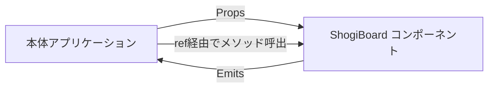
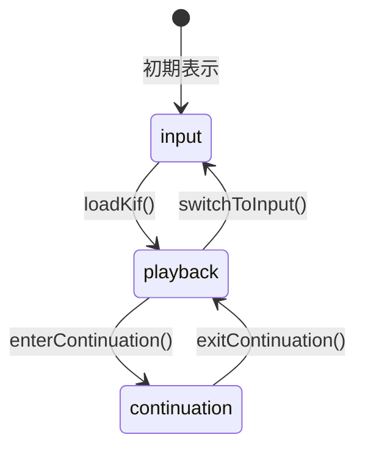

# 将棋盤コンポーネント インターフェース定義書

将棋盤Vueコンポーネント（ShogiBoard）と本体アプリケーション間のデータ受け渡しを定義する。

---

## 1. 概要

将棋盤コンポーネントは独立したVueコンポーネントとして開発する。
本体アプリケーションは **Props / defineExpose / Emits** を通じてのみコンポーネントと通信する。



---

## 2. Props

| Prop | 型 | 必須 | デフォルト | 説明 |
|------|-----|------|----------|------|
| `initialMode` | `AppMode` | - | `'input'` | 初期表示モード |

### AppMode

```typescript
type AppMode = 'input' | 'playback' | 'continuation'
```

| モード | 説明 | 盤面操作 |
|--------|------|---------|
| `input` | 駒を動かして棋譜を入力する | 可 |
| `playback` | KIF棋譜を読み込んで再生する | 不可（再生コントロールのみ） |
| `continuation` | 再生中の局面から自由に駒を動かす | 可 |

---

## 3. 公開メソッド（defineExpose）

本体アプリケーションは `ref` 経由でこれらのメソッドを呼び出す。

```typescript
const boardRef = ref<InstanceType<typeof ShogiBoard>>()
boardRef.value?.loadKif(kifString)
```

### 3.1 データ入出力

| メソッド | シグネチャ | 説明 |
|---------|-----------|------|
| `getSfen` | `() => string` | 現在の盤面をSFEN文字列で取得 |
| `getKif` | `() => string` | 現在の棋譜をKIF文字列で取得 |
| `loadSfen` | `(sfen: string) => void` | SFEN文字列から盤面をロード |
| `loadKif` | `(kif: string) => void` | KIF文字列から棋譜をロード（playbackモードに遷移） |
| `reset` | `() => void` | 盤面を初期状態にリセット（inputモードのみ） |
| `doUndo` | `() => void` | 1手戻す（input / continuationモードのみ） |

### 3.2 モード制御

| メソッド / プロパティ | シグネチャ | 説明 |
|---------------------|-----------|------|
| `mode` | `ComputedRef<AppMode>` | 現在のモード（読み取り専用） |
| `switchToInput` | `() => void` | inputモードに切り替え |
| `switchToPlayback` | `() => void` | playbackモードに切り替え |
| `enterContinuation` | `() => void` | continuationモードを開始 |
| `exitContinuation` | `() => void` | continuationモードを終了しplaybackに戻る |

### 3.3 再生コントロール

playbackモード時に使用する。

| メソッド / プロパティ | シグネチャ | 説明 |
|---------------------|-----------|------|
| `playback.currentMoveIndex` | `Ref<number>` | 現在の再生位置（0 = 初期局面） |
| `playback.totalMoves` | `ComputedRef<number>` | 総手数 |
| `playback.goToStart` | `() => void` | 初期局面に移動 |
| `playback.goToBack` | `() => void` | 1手戻す |
| `playback.goToForward` | `() => void` | 1手進める |
| `playback.goToEnd` | `() => void` | 最終局面に移動 |
| `playback.goToMove` | `(n: number) => void` | 指定した手数に移動 |

---

## 4. Emits

現時点ではEmitsは定義していない。本体アプリケーションが必要に応じて `ref` 経由で状態を取得する方式をとる。

今後、以下のようなイベントの追加を検討する。

| イベント（候補） | ペイロード | 用途 |
|----------------|-----------|------|
| `move` | `Move` | 指し手が実行された |
| `modeChange` | `AppMode` | モードが変更された |

---

## 5. 型定義

コンポーネントが使用する主要な型。

### 5.1 盤面関連

```typescript
type Player = 'sente' | 'gote'

type PieceType =
  | 'king' | 'rook' | 'bishop' | 'gold'
  | 'silver' | 'knight' | 'lance' | 'pawn'

interface Position {
  row: number  // 0-8（0 = 一段目/後手側、8 = 九段目/先手側）
  col: number  // 0-8（0 = 九筋/左、8 = 一筋/右）
}

interface Piece {
  type: PieceType
  owner: Player
  promoted: boolean
}

type Board = (Piece | null)[][]  // 9x9

type HandPieces = Partial<Record<PieceType, number>>

interface Hands {
  sente: HandPieces
  gote: HandPieces
}
```

### 5.2 指し手

```typescript
type Move = BoardMove | DropMove

interface BoardMove {
  type: 'move'
  from: Position
  to: Position
  promote: boolean
}

interface DropMove {
  type: 'drop'
  pieceType: PieceType
  to: Position
}
```

### 5.3 ゲーム状態

```typescript
interface GameState {
  board: Board
  hands: Hands
  turn: Player
  moveCount: number
  history: MoveRecord[]
}

interface MoveRecord {
  move: Move
  captured: Piece | null
}
```

### 5.4 KIFメタデータ

```typescript
interface KifMetadata {
  startDate?: string
  endDate?: string
  event?: string
  strategy?: string
  handicap?: string
  senteName?: string
  goteName?: string
  result?: string
}
```

---

## 6. SFEN形式

`getSfen()` / `loadSfen()` で使用する文字列形式。

```
lnsgkgsnl/1r5b1/ppppppppp/9/9/9/PPPPPPPPP/1B5R1/LNSGKGSNL b - 1
```

| フィールド | 説明 |
|-----------|------|
| 盤面 | `/` 区切りで9段。大文字=先手、小文字=後手。成駒は `+` 付き。数字=空きマス数 |
| 手番 | `b`（先手）/ `w`（後手） |
| 持駒 | `-`（なし）/ `2P3p`（大文字=先手、小文字=後手、数字=枚数） |
| 手数 | 1始まりの整数 |

---

## 7. モード遷移



### 各モードでの操作可否

| 操作 | input | playback | continuation |
|------|-------|----------|-------------|
| 駒の移動 | 可 | 不可 | 可 |
| 1手戻す | 可 | - | 可 |
| 再生コントロール | - | 可 | - |
| SFEN読込 | 可 | 不可 | 不可 |
| KIF読込 | 可 | 可 | 不可 |
| SFEN取得 | 可 | 可 | 可 |
| KIF取得 | 可 | 可 | 可 |
| リセット | 可 | 不可 | 不可 |

---

## 8. 本体アプリケーションの使用例

### 棋譜詳細画面（再生 + AI解析）

```typescript
const boardRef = ref<InstanceType<typeof ShogiBoard>>()

// KIF棋譜をロードして再生モードで表示
boardRef.value?.loadKif(kifuData.kifu)

// 任意の局面でAI解析をリクエスト
async function requestAnalysis() {
  const sfen = boardRef.value?.getSfen()
  if (sfen) {
    await api.post('/api/v1/analysis', {
      position: `position sfen ${sfen}`,
      movetime: 3000
    })
  }
}

// 継盤モードで検討
function startContinuation() {
  boardRef.value?.enterContinuation()
}
```

### 棋譜作成画面（入力モード）

```typescript
const boardRef = ref<InstanceType<typeof ShogiBoard>>()

// 保存時にKIF文字列を取得
async function save() {
  const kif = boardRef.value?.getKif()
  await api.post('/api/v1/kifus', {
    slug: '2025/01/vs-tanaka',
    kifu: kif,
    // ...
  })
}
```
