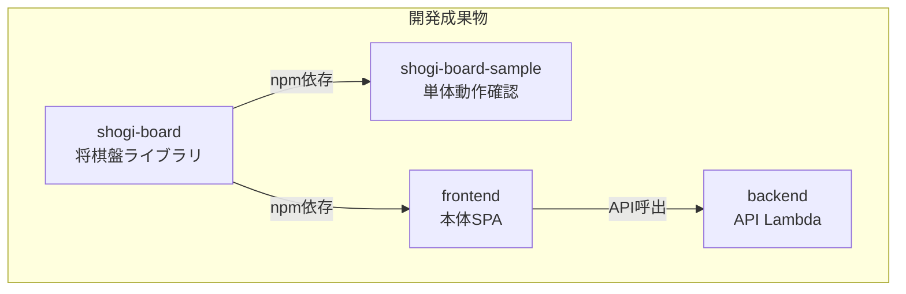

# プロジェクト構成

本プロジェクトのディレクトリ構成とモジュール間の関係を定義する。

---

## 1. 全体構成

```
ShogiProject/
├── docs/                       # 設計ドキュメント
├── shogi-board/                # 将棋盤ライブラリ（npm パッケージ）
├── shogi-board-sample/         # 将棋盤の単体動作確認用プロジェクト
├── frontend/                   # 本体アプリケーション（Vue 3 SPA）
├── backend/                    # API Lambda（Lambdalith）
└── ShogiProject_old/           # 旧システム（参照用）
```



---

## 2. モジュール詳細

### 2.1 shogi-board（将棋盤ライブラリ）

既存の `shogi-sample` をベースに、再利用可能なVueコンポーネントライブラリとして整備する。

```
shogi-board/
├── src/
│   ├── index.ts                # 公開API エントリポイント
│   ├── core/                   # 将棋ロジック（UIに依存しない）
│   │   ├── types.ts            # 型定義（Piece, Board, Move 等）
│   │   ├── constants.ts        # 定数（初期配置等）
│   │   ├── game.ts             # ゲーム状態管理
│   │   ├── moves.ts            # 駒の移動ロジック
│   │   ├── rules.ts            # ルール判定（合法手等）
│   │   ├── sfen.ts             # SFEN形式パーサ / シリアライザ
│   │   └── kif.ts              # KIF形式パーサ / シリアライザ
│   ├── components/             # Vue コンポーネント
│   │   ├── ShogiBoard.vue      # メインコンポーネント（公開用）
│   │   ├── Board.vue           # 盤面
│   │   ├── Square.vue          # マス
│   │   ├── Piece.vue           # 駒
│   │   ├── Hand.vue            # 持ち駒
│   │   ├── PlaybackControls.vue# 再生コントロール
│   │   └── GameInfo.vue        # ゲーム情報表示
│   └── composables/            # Vue コンポーザブル
│       ├── useGameState.ts     # ゲーム状態管理
│       ├── useMode.ts          # モード制御
│       ├── usePlayback.ts      # 再生制御
│       └── useSelection.ts     # 駒選択 / 移動先選択
├── tests/                      # テスト
├── package.json
├── vite.config.ts              # ライブラリモードでビルド
└── tsconfig.json
```

**ポイント:**

- 本体アプリケーション（`frontend`）から npm 依存として利用する
- `ShogiBoard.vue` が公開コンポーネント。Props / defineExpose / Emits のインターフェースは [interface-board.md](interface-board.md) に準拠する
- `core/` 配下はVueに依存しない純粋なTypeScriptモジュール。単体テストの対象

### 2.2 shogi-board-sample（単体動作確認用プロジェクト）

`shogi-board` を依存として使用する独立したVueアプリケーション。本体アプリケーションと切り離して将棋盤の動作確認・開発ができるようにする。

```
shogi-board-sample/
├── src/
│   ├── App.vue
│   ├── main.ts
│   ├── pages/
│   │   ├── TopPage.vue         # トップページ
│   │   ├── PlayPage.vue        # 入力モード確認
│   │   └── ReplayPage.vue      # 再生モード確認
│   └── router/
│       └── index.ts
├── package.json                # shogi-board をローカル依存として参照
├── vite.config.ts
└── tsconfig.json
```

**ポイント:**

- `shogi-board` への依存はローカルパス参照（`"shogi-board": "file:../shogi-board"`）またはnpm workspaces
- 本体アプリケーションの認証やAPI通信は含まない
- 将棋盤のすべてのモード（input / playback / continuation）を画面上で操作・確認できるようにする

### 2.3 frontend（本体アプリケーション）

Vue 3 SPA。`shogi-board` をコンポーネントとして組み込み、認証・API通信・画面遷移を担当する。

```
frontend/
├── src/
│   ├── App.vue
│   ├── main.ts
│   ├── router/                 # Vue Router（画面遷移）
│   ├── pages/                  # 各画面のページコンポーネント
│   ├── components/             # 共通UIコンポーネント
│   ├── composables/            # 共通ロジック
│   ├── api/                    # API通信（axios等）
│   ├── auth/                   # Cognito認証
│   └── types/                  # 型定義
├── package.json
├── vite.config.ts
└── tsconfig.json
```

**ポイント:**

- `shogi-board` を npm 依存として使用する
- 認証は Cognito SDK（Amplify）を直接利用する。APIにはJWTトークンを付与する
- API通信の詳細は [api-design.md](api-design.md) に準拠する
- 画面一覧は [requirements.md](requirements.md) のセクション4を参照

### 2.4 backend（API Lambda）

Lambdalith構成のREST API（Python）。全エンドポイントを1つのLambda関数で処理する。

```
backend/
├── app.py                      # Lambda ハンドラ / ルーティング
├── routes/                     # エンドポイント別ハンドラ
│   ├── users.py
│   ├── kifus.py
│   ├── tags.py
│   └── analysis.py
├── services/                   # ビジネスロジック
├── repositories/               # DynamoDBアクセス
├── common/                     # 共通ユーティリティ
├── tests/
├── requirements.txt
└── template.yaml               # SAM テンプレート
```

**ポイント:**

- Python で実装する
- Lambdalith構成。コールドスタート削減のため全エンドポイントを1つのLambdaに集約する
- エンドポイント仕様は [api-design.md](api-design.md) に準拠する
- 解析Lambda（コンテナイメージ）は本リポジトリには含まない。インターフェースは [interface-analysis.md](interface-analysis.md) を参照

---

## 3. モジュール間の依存関係

| 依存元 | 依存先 | 依存方法 |
|--------|--------|----------|
| `shogi-board-sample` | `shogi-board` | npm ローカルパス参照 |
| `frontend` | `shogi-board` | npm 依存 |
| `frontend` | `backend` | HTTP API（実行時） |
| `frontend` | Amazon Cognito | Cognito SDK（実行時） |
| `backend` | DynamoDB | boto3（実行時） |
| `backend` | SQS FIFO | boto3（実行時） |

---

## 4. 関連ドキュメント

| ドキュメント | 内容 |
|-------------|------|
| [requirements.md](requirements.md) | 要件定義書 |
| [api-design.md](api-design.md) | API設計書 |
| [interface-board.md](interface-board.md) | 将棋盤コンポーネント インターフェース定義書 |
| [interface-analysis.md](interface-analysis.md) | 解析Lambda インターフェース定義書 |
