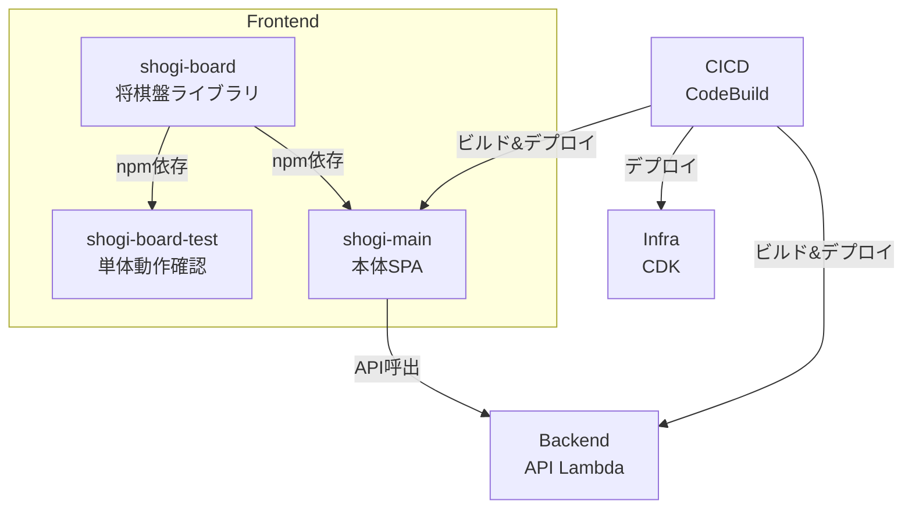

# プロジェクト構成

本プロジェクトのディレクトリ構成とモジュール間の関係を定義する。

---

## 1. 全体構成

```
ShogiProject/
├── docs/                       # 設計ドキュメント
├── Frontend/                   # フロントエンド関連（将来リポジトリ分割を想定）
│   ├── shogi-board/            # 将棋盤ライブラリ（npm パッケージ）
│   ├── shogi-board-test/       # 将棋盤の単体動作確認用プロジェクト
│   └── shogi-main/             # 本体アプリケーション（Vue 3 SPA）
├── Backend/                    # API Lambda（Lambdalith）
├── Infra/                      # インフラ（CDK）
├── CICD/                       # CI/CD（CloudFormation + CodeBuild）
└── ShogiProject_old/           # 旧システム（参照用）
```



---

## 2. モジュール詳細

### 2.1 shogi-board（将棋盤ライブラリ）

既存の `shogi-sample` をベースに、再利用可能なVueコンポーネントライブラリとして整備する。

```
Frontend/shogi-board/
├── src/
│   ├── index.ts                # 公開API エントリポイント
│   ├── core/                   # 将棋ロジック（UIに依存しない）
│   │   ├── types.ts            # 型定義（Piece, Board, Move 等）
│   │   ├── constants.ts        # 定数（初期配置等）
│   │   ├── game.ts             # ゲーム状態管理
│   │   ├── moves.ts            # 駒の移動ロジック
│   │   ├── rules.ts            # ルール判定（合法手等）
│   │   ├── sfen.ts             # SFEN形式パーサ / シリアライザ
│   │   └── kif.ts              # KIF形式パーサ / シリアライザ
│   ├── components/             # Vue コンポーネント
│   │   ├── ShogiBoard.vue      # メインコンポーネント（公開用）
│   │   ├── Board.vue           # 盤面
│   │   ├── Square.vue          # マス
│   │   ├── Piece.vue           # 駒
│   │   ├── Hand.vue            # 持ち駒
│   │   ├── PlaybackControls.vue# 再生コントロール
│   │   └── GameInfo.vue        # ゲーム情報表示
│   └── composables/            # Vue コンポーザブル
│       ├── useGameState.ts     # ゲーム状態管理
│       ├── useMode.ts          # モード制御
│       ├── usePlayback.ts      # 再生制御
│       └── useSelection.ts     # 駒選択 / 移動先選択
├── docs/                       # 将棋盤関連ドキュメント
├── tests/                      # テスト
├── package.json
├── vite.config.ts              # ライブラリモードでビルド
└── tsconfig.json
```

**ポイント:**

- 本体アプリケーション（`shogi-main`）から npm 依存として利用する
- `ShogiBoard.vue` が公開コンポーネント。Props / defineExpose / Emits のインターフェースは [interface-board.md](interface-board.md) に準拠する
- `core/` 配下はVueに依存しない純粋なTypeScriptモジュール。単体テストの対象

### 2.2 shogi-board-test（単体動作確認用プロジェクト）

`shogi-board` を依存として使用する独立したVueアプリケーション。本体アプリケーションと切り離して将棋盤の動作確認・開発ができるようにする。

```
Frontend/shogi-board-test/
├── src/
│   ├── App.vue
│   ├── main.ts
│   ├── pages/
│   │   ├── TopPage.vue         # トップページ
│   │   ├── PlayPage.vue        # 入力モード確認
│   │   └── ReplayPage.vue      # 再生モード確認
│   └── router/
│       └── index.ts
├── package.json                # shogi-board をローカル依存として参照
├── vite.config.ts
└── tsconfig.json
```

**ポイント:**

- `shogi-board` への依存はローカルパス参照（`"shogi-board": "file:../shogi-board"`）
- 本体アプリケーションの認証やAPI通信は含まない
- 将棋盤のすべてのモード（input / playback / continuation）を画面上で操作・確認できるようにする

### 2.3 shogi-main（本体アプリケーション）

Vue 3 SPA。`shogi-board` をコンポーネントとして組み込み、認証・API通信・画面遷移を担当する。

```
Frontend/shogi-main/
├── src/
│   ├── App.vue
│   ├── main.ts
│   ├── router/                 # Vue Router（画面遷移）
│   ├── pages/                  # 各画面のページコンポーネント
│   ├── components/             # 共通UIコンポーネント
│   ├── composables/            # 共通ロジック
│   ├── api/                    # API通信（axios等）
│   ├── auth/                   # Cognito認証
│   └── types/                  # 型定義
├── package.json
├── vite.config.ts
└── tsconfig.json
```

**ポイント:**

- `shogi-board` を npm 依存として使用する
- 認証は Cognito Managed Login + oidc-client-ts を利用する。詳細は [auth-design.md](auth-design.md) を参照
- API通信の詳細は [api-design.md](api-design.md) に準拠する
- 画面一覧は [requirements.md](requirements.md) のセクション4を参照

### 2.4 Backend（API Lambda）

Lambdalith構成のREST API（Python）。全エンドポイントを1つのLambda関数で処理する。

```
Backend/
├── src/                        # Lambda パッケージ対象（CodeUri）
│   ├── app.py                  # Lambda ハンドラ / ルーティング
│   ├── routes/                 # エンドポイント別ハンドラ
│   │   ├── users.py
│   │   ├── kifus.py
│   │   ├── tags.py
│   │   └── analysis.py
│   ├── services/               # ビジネスロジック
│   ├── repositories/           # DynamoDBアクセス
│   └── common/                 # 共通ユーティリティ
├── tests/
├── requirements.txt
└── template.yaml               # SAM テンプレート（CodeUri: src/）
```

**ポイント:**

- Python で実装する
- Lambdalith構成。コールドスタート削減のため全エンドポイントを1つのLambdaに集約する
- エンドポイント仕様は [api-design.md](api-design.md) に準拠する
- API Gateway と Lambda は SAM（`template.yaml`）で管理する
- 解析Lambda（コンテナイメージ）は本リポジトリには含まない。インターフェースは [interface-analysis.md](interface-analysis.md) を参照

### 2.5 Infra（インフラストラクチャ）

AWS CDK でアプリケーション基盤のインフラを管理する。

**CDK で管理するリソース:**

| リソース | 用途 |
|---------|------|
| S3 | フロントエンド静的ファイルホスティング |
| CloudFront | CDN配信、`/api/*` のAPI Gatewayルーティング |
| Cognito | ユーザー認証 |
| DynamoDB | データストア |
| SQS FIFO | 解析リクエストキュー |

**SAM で管理するリソース（Backend/template.yaml）:**

| リソース | 用途 |
|---------|------|
| API Gateway | REST APIエンドポイント |
| Lambda | API Lambda（Lambdalith） |

> CDKとSAMを分離する理由: API GatewayとLambdaはアプリケーションコードと密結合しており、
> SAMによるローカルテスト（`sam local`）やデプロイの利便性が高い。
> それ以外のインフラリソースは変更頻度が低く、CDKで一元管理する。

### 2.6 CICD（CI/CD パイプライン）

CloudFormation で CodeBuild プロジェクトを管理する。各ビルドパイプラインはプロジェクト別のテンプレートで定義する。

```
CICD/
├── frontend.yaml               # Frontend用 CodeBuild
├── backend.yaml                # Backend用 CodeBuild
└── infra.yaml                  # Infra用 CodeBuild
```

**CodeBuild プロジェクト一覧:**

| テンプレート | CodeBuild名 | ビルド内容 |
|-------------|------------|-----------|
| `frontend.yaml` | codebuild-sgp-frontend | shogi-board ビルド → shogi-main ビルド → S3デプロイ → CloudFrontキャッシュ無効化 |
| `backend.yaml` | codebuild-sgp-backend | SAM build → SAM deploy |
| `infra.yaml` | codebuild-sgp-infra | CDK deploy |

**ポイント:**

- 各テンプレートは CloudFormation（素のYAML）で記述する。CDK は使用しない
- ソース設定（GitHub連携等）は別途設定する
- Frontend のビルドでは shogi-board を先にビルドし、その成果物を shogi-main が利用する

---

## 3. モジュール間の依存関係

| 依存元 | 依存先 | 依存方法 |
|--------|--------|----------|
| `shogi-board-test` | `shogi-board` | npm ローカルパス参照 |
| `shogi-main` | `shogi-board` | npm 依存 |
| `shogi-main` | `Backend` | HTTP API（実行時） |
| `shogi-main` | Amazon Cognito | oidc-client-ts + Managed Login（実行時） |
| `Backend` | DynamoDB | boto3（実行時） |
| `Backend` | SQS FIFO | boto3（実行時） |

---

## 4. リポジトリ分割方針

`Frontend/` 配下の3プロジェクトは将来的に独立したリポジトリに分割することを想定している。

| 分割候補 | 想定リポジトリ | 備考 |
|---------|-------------|------|
| `Frontend/shogi-board` | shogi-board | npm パッケージとして公開可能 |
| `Frontend/shogi-board-test` | shogi-board（同一リポジトリ） | shogi-board と一体で管理 |
| `Frontend/shogi-main` | ShogiProject-frontend | 本体アプリケーション |
| `Backend/` | ShogiProject-backend | API Lambda |

---

## 5. 関連ドキュメント

| ドキュメント | 内容 |
|-------------|------|
| [requirements.md](requirements.md) | 要件定義書 |
| [api-design.md](api-design.md) | API設計書 |
| [interface-board.md](interface-board.md) | 将棋盤コンポーネント インターフェース定義書 |
| [interface-analysis.md](interface-analysis.md) | 解析Lambda インターフェース定義書 |
| [auth-design.md](auth-design.md) | 認証設計書 |
