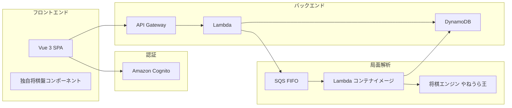
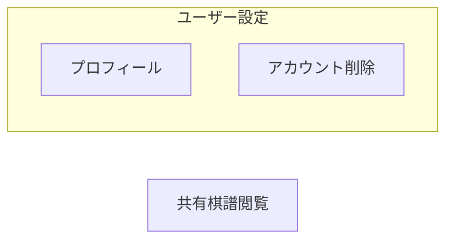

# 将棋棋譜管理アプリ 要件定義書

## 1. プロジェクト概要

### 1.1 目的

将棋の棋譜を安全に保管・整理し、AI局面解析を通じて棋力向上を支援するWebアプリケーションを開発する。

### 1.2 ターゲットユーザー

将棋を趣味や競技として楽しむ個人ユーザー。自分の対局棋譜を記録・振り返りたい人。

### 1.3 システム構成



| レイヤー | 技術 |
|---------|------|
| フロントエンド | Vue 3 + TypeScript |
| 将棋盤 | 独自実装（テキスト駒、CSS Grid） |
| API | Lambda + API Gateway（REST JSON） |
| 認証 | Amazon Cognito Managed Login + oidc-client-ts |
| DB | DynamoDB（Single Table Design） |
| 局面解析 | SQS FIFO → コンテナイメージLambda（やねうら王） |
| ホスティング | CloudFront + S3（同一オリジン構成） |

---

## 2. 機能要件

### 2.1 ホーム

#### F-HOME-01: ホーム画面

- 認証不要でアクセスできるランディングページ
- **未ログイン時**: アプリの概要と「ログイン」「今すぐ始める」ボタンを表示する
- **ログイン済み時**: 棋譜一覧（マイページ）、エクスプローラー、タグ一覧などの主要機能へのナビゲーションを表示する

---

### 2.2 ユーザー管理

#### F-AUTH-01: サインアップ

- Cognito Managed Login ページでメールアドレスとパスワードでアカウントを作成できる
- 確認コードがメールで送信され、入力すると登録が完了する

#### F-AUTH-02: ログイン / ログアウト

- Cognito Managed Login ページでメールアドレスとパスワードでログインできる
- ログアウトするとトークンが破棄され、認証が必要な操作ができなくなる

#### F-AUTH-03: パスワード変更

- Cognito Managed Login ページでパスワードを変更できる

#### F-AUTH-04: パスワードリセット

- Cognito Managed Login ページでパスワードをリセットできる

#### F-AUTH-05: アカウント削除

- 現在のパスワードを入力してアカウントを削除できる
- アカウント削除後、関連データはバックグラウンドで削除される

#### F-AUTH-06: ユーザープロフィール

- ユーザー名、メールアドレス、登録日を確認できる

---

### 2.3 棋譜管理

#### F-KIFU-01: 棋譜一覧（マイページ）

- 自分の棋譜を最終更新日の降順で表示する（直近のものを確認する用途）
- 各棋譜にはスラグ、先後、勝敗、付与されたタグが表示される
- ページネーションに対応する（1ページあたり最大50件、デフォルト10件）
- 直近のもの以外を探す場合は、フォルダエクスプローラーまたはタグ別棋譜一覧を使用する

#### F-KIFU-02: 棋譜作成

- 以下の情報を入力して棋譜を登録できる

| 項目 | 必須 | 説明 |
|------|------|------|
| スラグ | 要 | 棋譜の識別名。1〜100文字。パス区切り `/` で階層化可能（例: `2025/01/vs-tanaka`）。`.kif` は自動付与 |
| 棋譜データ | - | KIF形式テキストの直接入力、または将棋盤上で駒を動かして入力（どちらにも対応） |
| メモ | - | 対局の感想や分析コメント |
| 先後 | - | なし / 先手 / 後手 |
| 結果 | - | なし / 勝ち / 負け / 千日手 / 持将棋 |
| 共有 | - | 共有リンクを有効にするか（デフォルト: 無効） |
| タグ | - | 付与するタグの選択（複数可） |

- 1ユーザーあたりの棋譜上限は2000件
- スラグの重複は同一ユーザー内で不可

#### F-KIFU-03: 棋譜詳細表示

- 棋譜データを将棋盤上で再生できる
- メモ、先後、勝敗、タグ、作成日時、更新日時を確認できる
- 共有が有効な場合、共有リンクを確認・コピーできる
- この画面からAI局面解析をリクエストできる

#### F-KIFU-04: 棋譜編集

- 棋譜作成時に入力した全項目を編集できる
- 棋譜データはKIF形式テキストの直接編集、または将棋盤上での駒操作で変更できる
- タグの付け外しができる

#### F-KIFU-05: 棋譜削除

- 棋譜を削除できる
- 棋譜に紐づくタグ関連データも同時に削除される

#### F-KIFU-06: 棋譜共有

- 共有が有効な棋譜には一意の共有コードが発行される
- 共有リンクを知っている人は、認証なしで棋譜を閲覧できる
- 共有ページではスラグ、タグ、ユーザー名などのプライベート情報は表示されない

---

### 2.4 フォルダエクスプローラー

#### F-EXPLORER-01: 階層表示

- 棋譜のスラグをパス区切り `/` で解釈し、フォルダ階層として表示する
- 例: スラグが `2025/01/vs-tanaka.kif` の場合
  - `2025/` フォルダ → `01/` フォルダ → `vs-tanaka.kif` ファイル

#### F-EXPLORER-02: ナビゲーション

- フォルダをクリックしてサブフォルダに移動できる
- パンくずリストで上位階層に戻れる
- ファイルをクリックすると棋譜詳細画面に遷移する

#### F-EXPLORER-03: フォルダ情報

- 各フォルダには配下の棋譜数が表示される

---

### 2.5 タグ管理

#### F-TAG-01: タグ一覧

- 自分が作成したタグの一覧を表示できる

#### F-TAG-02: タグ作成

- タグ名（1〜127文字）を指定してタグを作成できる
- 1ユーザーあたりのタグ上限は50件

#### F-TAG-03: タグ編集

- タグ名を変更できる

#### F-TAG-04: タグ削除

- タグを削除できる
- 棋譜に付与されている関連データも同時に削除される

#### F-TAG-05: タグ別棋譜一覧

- 特定のタグが付与された棋譜の一覧を表示できる

---

### 2.6 AI局面解析

> **独立モジュール**: 解析機能（コンテナイメージLambda）は本体アプリケーションから独立して開発する。
> データの受け渡しのインターフェース定義は別ドキュメントに記載する。

#### F-ANALYSIS-01: 解析リクエスト

- 将棋盤上の任意の局面でAI解析をリクエストできる
- 解析対象は現在表示中の局面（SFEN形式）
- 思考時間を選択できる（3秒 / 5秒 / 10秒）

#### F-ANALYSIS-02: 解析結果表示

- 解析が完了すると候補手が表示される
- 各候補手には以下の情報が含まれる
  - 順位
  - 評価値（数値。正が先手有利、負が後手有利。詰みの場合は`#N`）
  - 読み筋（日本語棋譜表記）

#### F-ANALYSIS-03: レート制限

- 解析キュー内のメッセージが5件以上の場合、リクエストを拒否する
- 直近1時間の解析リクエストが30件以上の場合、リクエストを拒否する
- 拒否された場合、ユーザーに適切なメッセージを表示する

#### F-ANALYSIS-04: 非同期処理

- 解析はSQS FIFOキューを介して非同期で実行される
- フロントエンドはポーリングで解析結果を取得する
- 解析データは1時間後にTTLで自動削除される

---

### 2.7 将棋盤

> **独立モジュール**: 将棋盤はVueコンポーネントとして本体アプリケーションから独立して開発する。
> データの受け渡しのインターフェース定義は別ドキュメントに記載する。

#### F-BOARD-01: 盤面表示

- 9x9の将棋盤を表示する
- 駒はテキスト（漢字）で表示する
- 後手の駒は180度回転して表示する
- 成駒は色を変えて表示する
- 段・筋の座標ラベルを表示する

#### F-BOARD-02: 持ち駒表示

- 先手・後手それぞれの持ち駒を表示する
- 複数枚ある場合は枚数を表示する

#### F-BOARD-03: 棋譜再生

- KIF形式の棋譜を読み込んで再生できる
- 再生コントロール（先頭 / 1手戻る / 1手進む / 末尾）を提供する
- スライダーで任意の手数に移動できる
- 直前の指し手のマスをハイライト表示する

#### F-BOARD-04: 盤面入力（入力モード）

- 盤上の駒をクリックして移動先を選択できる
- 合法手のマスをハイライト表示する
- 持ち駒をクリックして盤上に打てる
- 成りの判定ダイアログを表示する（成る / 不成）

#### F-BOARD-05: 継盤モード

- 棋譜再生中の任意の局面から、自由に駒を動かせる
- 元の棋譜に戻ることができる

#### F-BOARD-06: SFEN出力

- 現在の盤面をSFEN形式で出力できる（AI解析リクエスト時に使用）

---

## 3. 非機能要件

### 3.1 セキュリティ

| ID | 要件 |
|----|------|
| NF-SEC-01 | 認証にはAmazon Cognitoを使用し、JWTトークンでAPI認証を行う |
| NF-SEC-02 | トークンはsessionStorageに保管し、API GatewayのCognito Authorizerで検証する |
| NF-SEC-03 | 共有棋譜以外のリソースは認証済みユーザーのみアクセス可能 |
| NF-SEC-04 | 他ユーザーのリソースへのアクセスは拒否する |
| NF-SEC-05 | フロントエンドはVueの自動エスケープとCSPヘッダーでXSS対策を行う |

### 3.2 パフォーマンス

| ID | 要件 |
|----|------|
| NF-PERF-01 | API応答時間は通常のCRUD操作で1秒以内 |
| NF-PERF-02 | AI解析は思考時間＋数秒のオーバーヘッドで結果を返す |
| NF-PERF-03 | DynamoDBはオンデマンドキャパシティで自動スケーリング |

### 3.3 可用性

| ID | 要件 |
|----|------|
| NF-AVAIL-01 | AWSのマネージドサービスに依存し、個別のHA構成は不要 |
| NF-AVAIL-02 | 解析Lambdaの障害は棋譜管理機能に影響しない（疎結合） |

### 3.4 データ

| ID | 要件 |
|----|------|
| NF-DATA-01 | 1ユーザーあたり棋譜最大2000件 |
| NF-DATA-02 | 1ユーザーあたりタグ最大50件 |
| NF-DATA-03 | 解析結果は1時間後にTTLで自動削除 |

### 3.5 ホスティング

| ID | 要件 |
|----|------|
| NF-HOST-01 | フロントエンドはS3 + CloudFrontで配信する |
| NF-HOST-02 | APIはCloudFrontの同一オリジンで `/api/*` をAPI Gatewayにルーティングする |

---

## 4. 画面一覧

#### メイン画面遷移

> サインアップ / ログイン / パスワードリセット は Cognito Managed Login ページで処理される。
> SPA内には認証画面を持たず、未認証時は Managed Login にリダイレクトする。

```mermaid
graph TD
  Home[ホーム]
  ML[Cognito Managed Login<br/>サインアップ / ログイン / PW リセット]
  Callback[/callback<br/>トークン取得]

  subgraph 棋譜
    KifuList[棋譜一覧（マイページ）]
    KifuDetail[棋譜詳細 / 盤面再生 / AI解析]
    KifuCreate[棋譜作成]
    KifuEdit[棋譜編集]
    Explorer[フォルダエクスプローラー]
  end

  subgraph タグ
    TagList[タグ一覧]
    TagCreate[タグ作成]
    TagEdit[タグ編集]
    TagDetail[タグ別棋譜一覧]
  end

  Home -->|未ログイン| ML
  ML --> Callback
  Callback --> Home
  Home -->|ログイン済| KifuList
  Home -->|ログイン済| Explorer
  Home -->|ログイン済| TagList
  KifuList --> KifuDetail
  KifuList --> KifuCreate
  KifuDetail --> KifuEdit
  Explorer --> KifuDetail
  TagList --> TagCreate
  TagList --> TagDetail
  TagList --> TagEdit
  TagDetail --> KifuDetail
```

#### その他の画面（共通ヘッダー・外部リンクからアクセス）



| 画面 | パス | 認証 | 備考 |
|------|------|------|------|
| ホーム | `/` | 不要（ログイン状態で表示内容が変わる） | |
| コールバック | `/callback` | 不要 | Cognito Managed Login からのリダイレクト受信 |
| 棋譜一覧 | `/kifus` | 要 | |
| 棋譜作成 | `/kifus/new` | 要 | |
| 棋譜詳細 | `/kifus/:kid` | 要 | |
| 棋譜編集 | `/kifus/:kid/edit` | 要 | |
| フォルダエクスプローラー | `/explorer` | 要 | |
| タグ一覧 | `/tags` | 要 | |
| タグ作成 | `/tags/new` | 要 | |
| タグ編集 | `/tags/:tid/edit` | 要 | |
| タグ別棋譜一覧 | `/tags/:tid` | 要 | |
| プロフィール | `/profile` | 要 | |
| アカウント削除 | `/delete-account` | 要 | |
| 共有棋譜閲覧 | `/shared/:share_code` | 不要 | |

> パスワード変更はCognito Managed Loginページで行う。SPA内の画面は不要。

---

## 5. 用語定義

| 用語 | 説明 |
|------|------|
| KIF | 将棋の棋譜記録形式。Kifu for Windows等で使われる標準フォーマット |
| SFEN | 将棋の局面を文字列で表現する形式。盤面・手番・持駒・手数を含む |
| USI | Universal Shogi Interface。将棋エンジンとGUIの通信プロトコル |
| スラグ | 棋譜の識別名。パス区切りで階層化可能（例: `2025/01/vs-tanaka`） |
| 共有コード | 棋譜共有用の一意な文字列。URLに含めて認証なしでアクセス可能にする |
| kid | 棋譜ID。12文字のランダム文字列 |
| tid | タグID。ランダム文字列 |
| aid | 解析ID。ランダム文字列 |
| 先後 | 先手（攻め手が先に指す側）/ 後手（後に指す側） |
| 成り | 駒が敵陣に入ったときに裏返して強い駒になること |
| 持ち駒 | 相手から取った駒。盤外に保持し、任意のタイミングで盤上に打てる |
| 継盤 | 棋譜再生中の局面から、実際に駒を動かして変化を検討すること |
