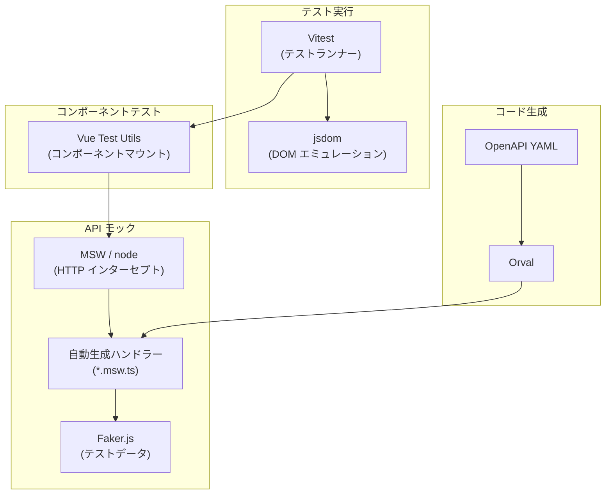

# 使用ツールの解説

本プロジェクトのフロントエンドテストで使用する主要ツールを解説する。

---

## 1. Vitest — テストランナー / テストフレームワーク

### Vitest とは

Vitest は **Vite ベースのテストフレームワーク**。テストの記述・実行・結果レポートを担う、テスト基盤の中核。

従来、JavaScript のテストフレームワークとしては **Jest** が広く使われてきたが、Vitest は Vite を使うプロジェクト向けに設計された次世代のテストフレームワークである。Vue / Vite チームのメンバーが開発・メンテナンスしている。

### なぜ Vitest なのか（Jest との比較）

| 観点 | Vitest | Jest |
|------|--------|------|
| **Vite との統合** | `vite.config.ts` の設定を自動的に共有。設定の二重管理が不要 | 別途 Babel / ts-jest 等のトランスフォーマー設定が必要 |
| **ESM サポート** | ネイティブ対応。追加設定不要 | 実験的サポート。互換性フラグが必要 |
| **速度** | Vite の高速なモジュール変換を利用。Jest より大幅に高速 | 比較的低速 |
| **設定の簡便さ** | Vite プロジェクトでは設定ゼロ〜最小限 | Vue + TypeScript の組み合わせで設定が複雑になりがち |
| **API 互換性** | Jest 互換の API を提供。`describe`, `it`, `expect` がそのまま使える | — |

本プロジェクトは Vite でビルドしているため、**Vitest が最適な選択肢**となる。

### Vitest の基本的な書き方

```typescript
import { describe, it, expect } from 'vitest'

// describe でテストグループを定義
describe('足し算関数', () => {

  // it (または test) で個別のテストケースを定義
  it('1 + 2 は 3 になる', () => {
    expect(1 + 2).toBe(3)
  })

  it('0 を足しても値は変わらない', () => {
    expect(5 + 0).toBe(5)
  })
})
```

#### 主要な API

| API | 役割 | 例 |
|-----|------|-----|
| `describe(name, fn)` | テストをグループ化する | `describe('parseSfen', () => { ... })` |
| `it(name, fn)` / `test(name, fn)` | 1 つのテストケースを定義する | `it('平手初期局面をパースできる', () => { ... })` |
| `expect(value)` | 値を検証する（アサーション） | `expect(result).toBe(3)` |
| `beforeEach(fn)` | 各テストの前に実行する処理 | テストデータの初期化 |
| `afterEach(fn)` | 各テストの後に実行する処理 | クリーンアップ |

#### 主要なアサーション（`expect` のメソッド）

| メソッド | 意味 | 例 |
|---------|------|-----|
| `.toBe(value)` | 厳密等価（`===`） | `expect(1 + 1).toBe(2)` |
| `.toEqual(value)` | オブジェクトの深い比較 | `expect({ a: 1 }).toEqual({ a: 1 })` |
| `.toBeTruthy()` | 真と評価される | `expect('hello').toBeTruthy()` |
| `.toBeNull()` | `null` である | `expect(result).toBeNull()` |
| `.toContain(item)` | 配列/文字列に含まれる | `expect([1, 2, 3]).toContain(2)` |
| `.toThrow()` | 例外をスローする | `expect(() => parse('')).toThrow()` |
| `.toHaveLength(n)` | 配列/文字列の長さ | `expect([1, 2]).toHaveLength(2)` |

### DOM 環境

通常のテストは Node.js 上で実行されるが、Vue コンポーネントのテストでは DOM（ブラウザの API）が必要になる。Vitest では **jsdom** または **happy-dom** をテスト環境として指定できる。

| 環境 | 特徴 |
|------|------|
| `jsdom` | ブラウザ環境をより忠実に再現。互換性が高い |
| `happy-dom` | jsdom より高速・軽量。多くのケースで十分 |

設定例:

```typescript
// vite.config.ts
export default defineConfig({
  test: {
    environment: 'jsdom', // DOM 環境を有効化
  },
})
```

---

## 2. Vue Test Utils — Vue コンポーネントのテストユーティリティ

### Vue Test Utils とは

**Vue.js 公式のテストユーティリティライブラリ**（パッケージ名: `@vue/test-utils`）。Vue コンポーネントを分離された環境でマウント（描画）し、操作・検証するためのメソッドを提供する。

### 基本的な使い方

#### コンポーネントをマウントする

```typescript
import { mount } from '@vue/test-utils'
import MyButton from './MyButton.vue'

test('ボタンのラベルが表示される', () => {
  // mount() でコンポーネントを描画
  const wrapper = mount(MyButton, {
    props: { label: 'クリック' }
  })

  // wrapper を通じてレンダリング結果を検証
  expect(wrapper.text()).toContain('クリック')
})
```

`mount()` は以下を行う:
1. Vue コンポーネントインスタンスを作成
2. DOM にレンダリング（jsdom / happy-dom 上）
3. 操作・検証用のメソッドを持つ `wrapper` オブジェクトを返す

#### wrapper の主要メソッド

| メソッド | 説明 | 例 |
|---------|------|-----|
| `wrapper.text()` | レンダリングされたテキストを取得 | `expect(wrapper.text()).toContain('Hello')` |
| `wrapper.html()` | レンダリングされた HTML を取得 | デバッグ用 |
| `wrapper.find(selector)` | CSS セレクターで要素を検索 | `wrapper.find('.error-message')` |
| `wrapper.findAll(selector)` | 一致する全要素を取得 | `wrapper.findAll('li')` |
| `wrapper.trigger(event)` | DOM イベントを発火 | `await wrapper.find('button').trigger('click')` |
| `wrapper.exists()` | 要素が存在するか | `expect(wrapper.find('.error').exists()).toBe(false)` |
| `wrapper.emitted()` | emit されたイベントを取得 | `expect(wrapper.emitted('submit')).toHaveLength(1)` |

#### マウントオプション

```typescript
mount(MyComponent, {
  // props を渡す
  props: { title: 'テスト' },

  // グローバル設定（プラグイン、スタブ等）
  global: {
    plugins: [router],      // Vue Router 等のプラグイン
    stubs: {                 // 子コンポーネントをスタブに置換
      HeavyComponent: true,  // <HeavyComponent /> を空のスタブに
    },
  },
})
```

### mount と shallowMount

| 関数 | 説明 | 用途 |
|------|------|------|
| `mount()` | コンポーネントと全ての子コンポーネントを描画 | 統合的なテスト |
| `shallowMount()` | 子コンポーネントをスタブ化して描画 | 対象コンポーネントのロジックのみをテスト |

Vue 公式ガイドでは `mount()` を推奨しているが、テスト対象を絞りたい場合やサードパーティコンポーネント（PrimeVue 等）が重い場合は `shallowMount()` も有効。

---

## 3. MSW (Mock Service Worker) — API モッキング

### MSW とは

**ネットワークレベルで HTTP リクエストをインターセプト**し、モックレスポンスを返すライブラリ。本プロジェクトでは開発環境での API モックに既に導入済み。

### 開発環境とテスト環境での違い

MSW は 2 つの動作モードを持つ:

| モード | 用途 | 仕組み |
|--------|------|--------|
| `msw/browser` | 開発環境（ブラウザ） | Service Worker を使ってリクエストをインターセプト |
| `msw/node` | テスト環境（Node.js） | Node.js の HTTP モジュールをパッチしてインターセプト |

**テストでは `msw/node` を使用する。** コードの変更は不要で、テスト対象のコードが `fetch` を呼び出すと MSW がそれを捕捉してモックレスポンスを返す。

```
テスト対象コード ──fetch()──▶ MSW がインターセプト ──モックレスポンス──▶ テスト対象コード
                            （実際の HTTP 通信は発生しない）
```

### 本プロジェクトの MSW 活用状況

既に Orval（API コード生成ツール）が OpenAPI 定義から以下を自動生成している:

| 生成物 | ファイル例 | 内容 |
|--------|-----------|------|
| API クライアント関数 | `kifus.ts` | `getRecentKifus()`, `createKifu()` 等 |
| MSW ハンドラー | `kifus.msw.ts` | 各 API エンドポイントのモックレスポンス定義 |
| モックレスポンス生成関数 | `kifus.msw.ts` 内 | Faker.js でランダムなテストデータを生成 |

現在はブラウザ用（`msw/browser`）にのみセットアップされている:

```typescript
// 現在のセットアップ（ブラウザ開発環境用）
// src/mocks/browser.ts
import { setupWorker } from 'msw/browser'
import { getKifusMock } from '@/api/generated/main/kifus/kifus.msw'
// ...
export const worker = setupWorker(...getKifusMock(), ...)
```

テスト用に `msw/node` でも同じハンドラーを使うセットアップを追加する（詳細は `03_setup.md`）。

### テストでの MSW 利用イメージ

```typescript
import { server } from '@/mocks/server' // テスト用 MSW サーバー
import { http, HttpResponse } from 'msw'

// デフォルトでは自動生成されたモックレスポンスが使われる

test('API エラー時にエラーメッセージを表示する', async () => {
  // このテストだけ 500 エラーを返すように上書き
  server.use(
    http.get('*/kifus/recent', () => {
      return HttpResponse.json(
        { message: 'Internal Server Error' },
        { status: 500 }
      )
    })
  )

  // コンポーネントをマウントしてエラー表示を検証
  // ...
})
```

### MSW のメリット

| メリット | 説明 |
|---------|------|
| **HTTP クライアント非依存** | `fetch`, `axios` など何を使っていてもモック可能 |
| **コード変更不要** | テスト対象のコードにモック用の分岐を入れる必要がない |
| **開発環境と共通** | ブラウザでのモックとテストのモックで同じハンドラーを使える |
| **テスト単位の上書き** | `server.use()` で特定テストだけ別の挙動にできる |
| **Orval との連携** | OpenAPI 定義からハンドラーが自動生成される |

---

## 4. 補足: テストに関連する既存ツール

本プロジェクトで既にテスト基盤の一部として機能しているツール。

### Orval — API コード生成

OpenAPI YAML 定義（`docs/openapi_*.yaml`）から以下を自動生成するツール:

- TypeScript の API クライアント関数
- TypeScript の型定義（リクエスト/レスポンスモデル）
- MSW モックハンドラー + Faker.js によるモックデータ生成関数

```
openapi_main.yaml ──Orval──▶ src/api/generated/main/
                              ├── kifus/kifus.ts      (API クライアント)
                              ├── kifus/kifus.msw.ts  (MSW ハンドラー)
                              └── model/              (型定義)
```

### Faker.js — テストデータ生成

ランダムなテストデータ（文字列、数値、日付等）を生成するライブラリ。Orval が MSW モックハンドラー内で使用している。

---

## ツール間の関係図



Vitest がテストの実行基盤となり、Vue Test Utils がコンポーネントのマウント・操作を担い、MSW が API 通信のモックを提供する。この 3 層構造でフロントエンドテストを構成する。
