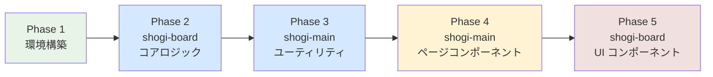

# テスト対象と優先度

テスト対象を一覧化し、優先度を定める。

---

## 優先度の基準

| 優先度 | 基準 |
|--------|------|
| **A（高）** | バグの影響が大きい / テストが書きやすい（純粋関数）/ 投資対効果が高い |
| **B（中）** | 画面の主要機能 / API 連携を含む |
| **C（低）** | UI の見た目が中心 / テスト環境の構築コストが高い |

---

## 1. shogi-board — コアロジック【優先度 A】

将棋のゲームロジックはフレームワーク非依存の**純粋関数**であり、最もテストしやすく、最もバグの影響が大きい領域。

### 1.1 game.ts — 局面操作

| 関数 | テスト内容 | 優先度 |
|------|-----------|--------|
| `createInitialState()` | 平手初期局面が正しく生成されるか | A |
| `applyMove()` — 盤上の駒移動 | 駒が正しく移動し、盤面が更新されるか | A |
| `applyMove()` — 駒取り | 取った駒が持ち駒に加算されるか | A |
| `applyMove()` — 成り | `promote: true` のとき駒が成るか | A |
| `applyMove()` — 駒打ち | 持ち駒が盤上に配置され、手持ちから減るか | A |
| `applyMove()` — 手番交代 | 指し手の後、手番が入れ替わるか | A |
| `undoMove()` | 1 手戻して元の局面が復元されるか | A |
| `undoMove()` — 履歴が空 | `null` を返すか | A |
| `replayToMove()` | 指定した手数まで正しく再生されるか | A |

### 1.2 sfen.ts — SFEN 変換

| 関数 | テスト内容 | 優先度 |
|------|-----------|--------|
| `toSfen()` | 平手初期局面の SFEN 文字列が正しいか | A |
| `toSfen()` | 途中局面（持ち駒あり）の SFEN が正しいか | A |
| `parseSfen()` | 標準的な SFEN 文字列をパースできるか | A |
| `parseSfen()` | 不正な SFEN でエラーをスローするか | A |
| `toSfen` → `parseSfen` | 往復変換で元の局面が復元されるか（ラウンドトリップ） | A |
| `moveToUsi()` | 盤上移動・駒打ち・成りが USI 表記に変換されるか | A |
| `parseUsiMove()` | USI 表記から Move オブジェクトに変換されるか | A |

### 1.3 kif.ts — KIF 変換

| 関数 | テスト内容 | 優先度 |
|------|-----------|--------|
| `parseKif()` | 基本的な KIF 文字列をパースできるか | A |
| `parseKif()` | メタデータ（対局者名、棋戦名等）を正しく読み取るか | A |
| `parseKif()` | 「同」表記（前手と同じマスへの移動）を正しく解析するか | A |
| `parseKif()` | 駒打ち（「打」表記）を正しく解析するか | A |
| `parseKif()` | 投了・中断等の結果行を処理できるか | A |
| `toKif()` | GameState から KIF 文字列を生成できるか | B |
| `toKif` → `parseKif` | 往復変換で局面が一致するか（ラウンドトリップ） | A |

### 1.4 moves.ts — 駒の移動先生成

| 関数 | テスト内容 | 優先度 |
|------|-----------|--------|
| `getPieceMovements()` | 各駒種の移動先が正しいか（王、飛、角、金、銀、桂、香、歩） | A |
| `getPieceMovements()` | 成り駒の移動先が正しいか（龍、馬、成銀等） | A |
| `getPieceMovements()` | 自駒でブロックされた先には移動できないか | A |
| `getPieceMovements()` | 敵駒は取れるがその先には進めないか（飛・角等の走り駒） | A |
| `findKing()` | 盤上の玉の位置を正しく返すか | A |
| `isSquareAttackedBy()` | 特定のマスが攻撃されているか判定できるか | A |

### 1.5 rules.ts — ルール判定

| 関数 | テスト内容 | 優先度 |
|------|-----------|--------|
| `isInCheck()` | 王手がかかっている局面を正しく検知するか | A |
| `getPromotionStatus()` | 成りの必須/任意/不可を正しく判定するか | A |
| `isNifu()` | 二歩を正しく検知するか | A |
| `getLegalBoardMoves()` | 合法手のみが返されるか（王手放置の排除） | A |
| `getLegalDropPositions()` | 駒打ちの合法位置が正しいか（行き所のない駒の排除） | A |
| `getLegalDropPositions()` | 打ち歩詰めが排除されるか | B |
| `isCheckmate()` | 詰みを正しく判定するか | B |

---

## 2. shogi-main — ユーティリティ関数【優先度 A】

純粋関数であり、テストが容易。

### 2.1 utils/explorer.ts

| 関数 | テスト内容 | 優先度 |
|------|-----------|--------|
| `buildBreadcrumbs()` | パス文字列からパンくずリストを生成できるか | A |
| `buildBreadcrumbs()` | 空文字列で空配列を返すか | A |
| `buildBreadcrumbs()` | 深いパス（`a/b/c/d`）で累積パスが正しいか | A |

### 2.2 utils/labels.ts

| 対象 | テスト内容 | 優先度 |
|------|-----------|--------|
| `sideLabel` | 各キー（`none`, `sente`, `gote`）が正しい日本語ラベルに対応しているか | A |
| `resultLabel` | 各キー（`none`, `win`, `loss`, `sennichite`, `jishogi`）が正しいか | A |

---

## 3. shogi-main — ページコンポーネント【優先度 B】

Vue コンポーネントのテスト。MSW モックを活用して API 連携も含めたテストを行う。

### 3.1 棋譜関連ページ

| ページ | テスト内容 | 優先度 |
|--------|-----------|--------|
| `KifuListPage.vue` | API から棋譜一覧を取得して表示するか | B |
| `KifuListPage.vue` | 棋譜行クリックで詳細ページに遷移するか | B |
| `KifuListPage.vue` | 棋譜が 0 件のとき「棋譜がありません」を表示するか | B |
| `KifuListPage.vue` | 保存棋譜数（`totalCount`）が表示されるか | B |
| `KifuDetailPage.vue` | 棋譜詳細データを取得して表示するか | B |
| `KifuCreatePage.vue` | フォーム入力と送信が動作するか | B |
| `KifuEditPage.vue` | 既存データの読み込みと更新が動作するか | B |

### 3.2 タグ関連ページ

| ページ | テスト内容 | 優先度 |
|--------|-----------|--------|
| `TagListPage.vue` | タグ一覧を取得して表示するか | B |
| `TagCreatePage.vue` | タグの作成が動作するか | B |
| `TagDetailPage.vue` | タグ詳細と関連棋譜を表示するか | B |

### 3.3 その他ページ

| ページ | テスト内容 | 優先度 |
|--------|-----------|--------|
| `ExplorerPage.vue` | フォルダ階層の表示と遷移が動作するか | B |
| `SharedKifuPage.vue` | 共有コードで棋譜を取得・表示するか | B |
| `HomePage.vue` | ダッシュボード情報が表示されるか | C |
| `ProfilePage.vue` | プロフィール情報が表示されるか | C |
| `DeleteAccountPage.vue` | 削除確認フローが動作するか | C |

---

## 4. shogi-main — ルーティング / 認証【優先度 B】

| 対象 | テスト内容 | 優先度 |
|------|-----------|--------|
| ルーター定義 | 各パスが正しいコンポーネントに解決されるか | B |
| 認証ガード | `meta.requiresAuth` なルートで未認証時の挙動 | B |

> 注: 認証ガードは現在モック実装（常に認証済み扱い）のため、Cognito 統合後にテストを拡充する。

---

## 5. shogi-board — Vue コンポーネント【優先度 C】

| コンポーネント | テスト内容 | 優先度 |
|--------------|-----------|--------|
| `ShogiBoard.vue` | props を渡して盤面が描画されるか | C |
| `PlaybackControls.vue` | 再生ボタン操作で正しいイベントが emit されるか | C |

> コンポーネントテストは PrimeVue 等のサードパーティ依存があるため、セットアップコストがやや高い。コアロジックのテスト充実後に着手する。

---

## 実装順のまとめ

| Phase | 対象 | 優先度 | 推定テスト数 |
|-------|------|--------|------------|
| 1 | 環境構築（Vitest + MSW セットアップ） | — | — |
| 2 | shogi-board コアロジック（game, sfen, kif, moves, rules） | A | 50〜80 |
| 3 | shogi-main ユーティリティ（explorer, labels） | A | 5〜10 |
| 4 | shogi-main ページコンポーネント | B | 20〜30 |
| 5 | shogi-board UI コンポーネント | C | 5〜10 |
