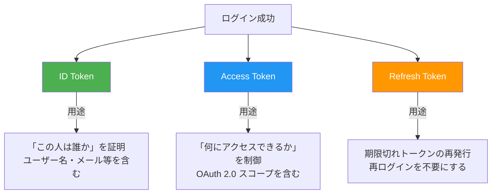
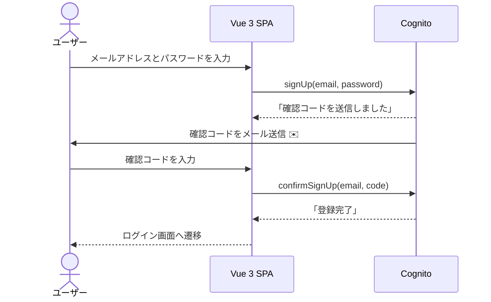
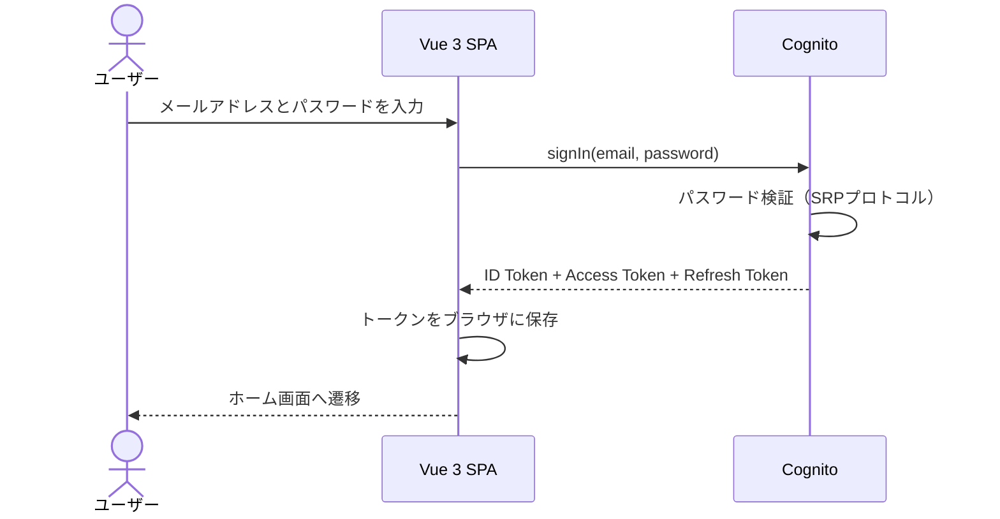
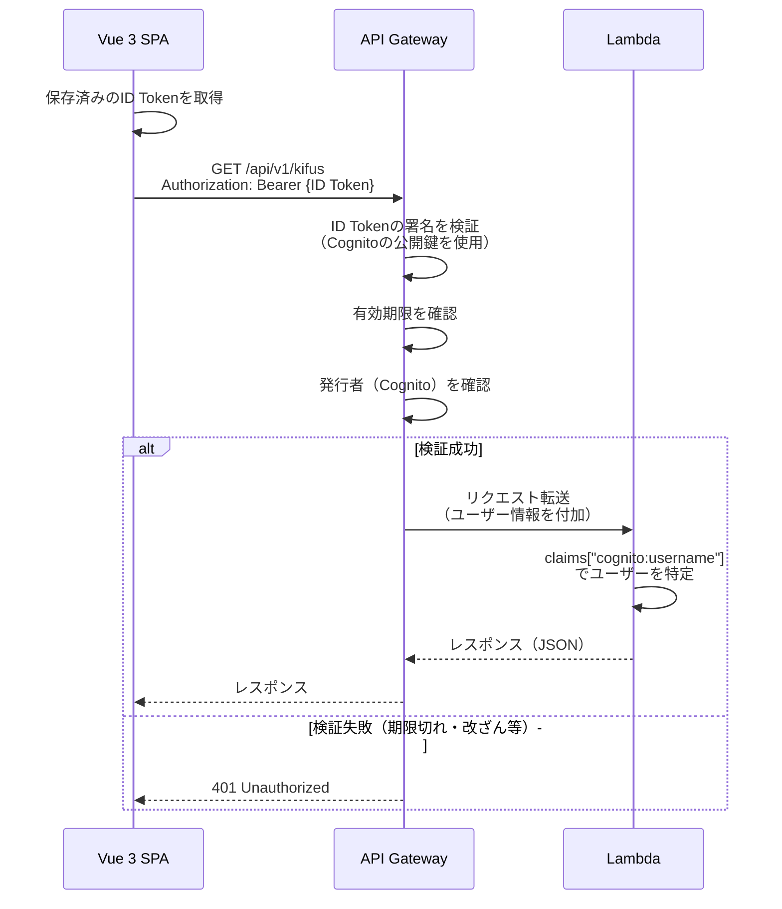
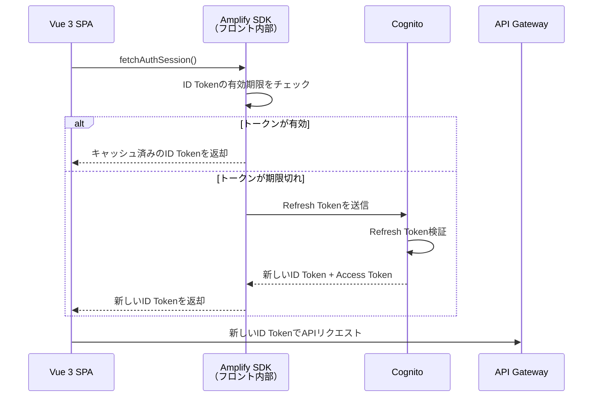
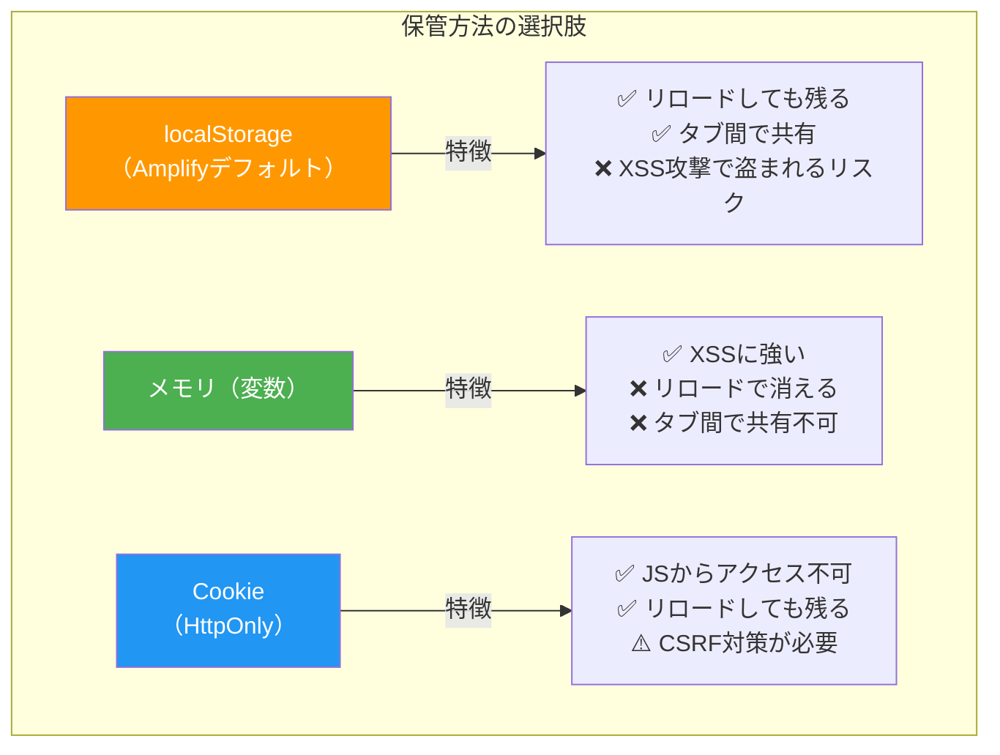
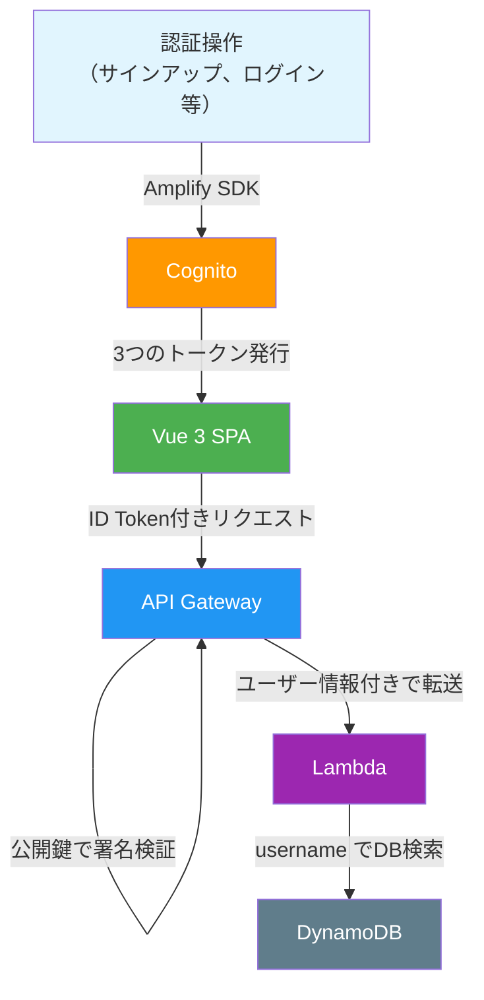

# Cognito + JWT 認証ガイド

本アプリ（Vue 3 SPA + Lambda + API Gateway）で採用する認証方式の解説。

---

## 1. なぜこの認証方式なのか

旧システム（SSR）ではサーバー側でログイン処理からセッション管理まですべて行っていた。
SPA（Single Page Application）では**フロントエンドとバックエンドが完全に分離**されるため、認証の仕組みが変わる。

```mermaid
graph LR
  subgraph 旧システム（SSR）
    A[ブラウザ] -->|ログインフォーム送信| B[Lambda]
    B -->|Cognito認証| C[Cognito]
    B -->|セッションCookie発行| A
    A -->|Cookie付きリクエスト| B
  end
```

```mermaid
graph LR
  subgraph 新システム（SPA）
    A[Vue 3 SPA] -->|直接認証| C[Cognito]
    C -->|トークン発行| A
    A -->|トークン付きAPIリクエスト| B[API Gateway + Lambda]
    B -->|トークン検証| B
  end
```

**ポイント**: 新システムではログイン処理にLambdaを経由しない。フロントエンドが直接Cognitoと通信する。

---

## 2. Cognitoが発行する3つのトークン

ログインが成功すると、Cognitoは**3種類のトークン**を発行する。



### 各トークンの比較

| | ID Token | Access Token | Refresh Token |
|---|---|---|---|
| **中身** | ユーザー情報（名前、メール等） | アクセス権限（スコープ） | 暗号化済み（中身は見えない） |
| **有効期限** | 1時間（デフォルト） | 1時間（デフォルト） | 30日（デフォルト） |
| **本アプリでの用途** | API呼出時にヘッダーに付与 | 使用しない | トークン自動更新 |
| **形式** | JWT（デコード可能） | JWT（デコード可能） | 暗号化文字列 |

### 本アプリでは「ID Token」を使う

API Gatewayでスコープ制御（「このユーザーは読み取りのみ」など）を行わない場合、**ID Token**を使うのが標準。
API GatewayはID Tokenからユーザー名やメールアドレスを取り出して、Lambdaに渡してくれる。

---

## 3. 認証の全体フロー

### 3.1 サインアップ（ユーザー登録）



### 3.2 ログイン



### 3.3 API呼出（認証済みリクエスト）



**重要**: API Gatewayは**毎回Cognitoに問い合わせるわけではない**。Cognitoが公開している公開鍵（JWKS）を使って、API Gateway内部でトークンの正当性を検証する。これにより高速に動作する。

### 3.4 トークンの自動更新（リフレッシュ）

ID Tokenは1時間で有効期限が切れる。ユーザーに毎回再ログインさせないために、Refresh Tokenで自動更新する。



**Amplify SDKがこの処理を自動で行う**。開発者が意識する必要はほぼない。

---

## 4. トークンの保管場所

トークンをブラウザのどこに保存するかはセキュリティ上の重要な判断。



### 本アプリでの方針

| トークン | 保管場所 | 理由 |
|---------|---------|------|
| ID Token / Access Token | **Amplifyデフォルト（localStorage）** | Amplify SDKの標準動作。短命（1時間）なのでリスクは限定的 |
| Refresh Token | **Amplifyデフォルト（localStorage）** | 同上。Cognitoのトークン無効化（Revoke）機能で対処可能 |

> **補足**: セキュリティ要件が高い場合はCookie Storageへの切り替えも可能だが、
> 本アプリでは棋譜管理という性質上、Amplifyデフォルトで十分と判断する。

---

## 5. JWTトークンの中身

ID Tokenは「JWT」（JSON Web Token）という形式。3つのパートがドット（`.`）で繋がった文字列。

```
eyJhbGciOiJSUzI1NiIsInR5cCI6IkpXVCJ9.eyJzdWIiOiJ...  .SflKxwRJSMeKKF2QT4fw...
 ^^^^^^^^^^^^^^^^^^^^^^^^^^^^^^^^^^^^^^^^ ^^^^^^^^^^^^^^  ^^^^^^^^^^^^^^^^^^^^^^^
           ヘッダー（署名アルゴリズム等）      ペイロード（ユーザー情報）    署名
```

### ペイロード（中身）の例

```json
{
  "sub": "a1b2c3d4-e5f6-7890-abcd-ef1234567890",
  "cognito:username": "hakira",
  "email": "hakira@example.com",
  "email_verified": true,
  "token_use": "id",
  "iss": "https://cognito-idp.ap-northeast-1.amazonaws.com/ap-northeast-1_XXXXX",
  "aud": "1234567890abcdefghijklmnop",
  "exp": 1737543600,
  "iat": 1737540000
}
```

| フィールド | 説明 |
|-----------|------|
| `sub` | ユーザーの一意識別子（UUID） |
| `cognito:username` | ユーザー名。**Lambda側でこの値を使ってユーザーを特定する** |
| `email` | メールアドレス |
| `token_use` | トークン種別（`id` or `access`） |
| `iss` | 発行者（CognitoユーザープールのURL） |
| `aud` | 対象（CognitoアプリクライアントID） |
| `exp` | 有効期限（UNIXタイムスタンプ） |
| `iat` | 発行日時（UNIXタイムスタンプ） |

### API Gatewayの検証内容

API Gatewayは以下を確認してから、Lambdaにリクエストを転送する：

1. **署名の正当性**: Cognitoの公開鍵（JWKS）で署名を検証 → 改ざんされていないか
2. **有効期限**: `exp` が現在時刻より未来か → 期限切れではないか
3. **発行者**: `iss` が正しいCognitoユーザープールか → 偽のトークンではないか
4. **対象**: `aud` が正しいアプリクライアントIDか → 別アプリのトークンではないか

---

## 6. Lambdaでのユーザー特定

API Gatewayが検証を通過すると、トークンの中身（claims）がLambdaのイベントに付加される。

```python
def lambda_handler(event, context):
    # API Gatewayが付加したユーザー情報を取得
    claims = event["requestContext"]["authorizer"]["claims"]

    username = claims["cognito:username"]  # → "hakira"
    email = claims["email"]                # → "hakira@example.com"

    # このusernameでDynamoDBを検索
    # pk = f"kifu#uname#{username}"
```

**Lambda側でトークンの検証処理を書く必要はない**。API Gatewayがすべて行ってくれる。

---

## 7. フロントエンド実装の全体像

### Amplify SDK のセットアップ

```typescript
// main.ts
import { Amplify } from 'aws-amplify'

Amplify.configure({
  Auth: {
    Cognito: {
      userPoolId: 'ap-northeast-1_XXXXX',
      userPoolClientId: 'xxxxxxxxxxxxxxxxxxxxxxxxxxxx',
    }
  }
})
```

### 認証操作の対応表

| 画面 | Amplify API | Lambda API |
|------|------------|------------|
| サインアップ | `signUp()` | **不要** |
| メール確認 | `confirmSignUp()` | **不要** |
| ログイン | `signIn()` | **不要** |
| ログアウト | `signOut()` | **不要** |
| パスワード変更 | `updatePassword()` | **不要** |
| パスワード忘却 | `resetPassword()` + `confirmResetPassword()` | **不要** |
| プロフィール表示 | - | `GET /api/v1/users/me` |
| アカウント削除 | - | `DELETE /api/v1/users/me` |

**認証操作のほとんどはフロントエンドで完結し、Lambda APIは不要。**

### API呼出の共通パターン

```typescript
import { fetchAuthSession } from 'aws-amplify/auth'

async function apiRequest(method: string, path: string, body?: object) {
  // Amplify SDKがトークンの有効期限チェック＆自動更新を行う
  const session = await fetchAuthSession()
  const token = session.tokens?.idToken?.toString()

  const response = await fetch(`${API_BASE_URL}${path}`, {
    method,
    headers: {
      'Authorization': `Bearer ${token}`,
      'Content-Type': 'application/json',
    },
    body: body ? JSON.stringify(body) : undefined,
  })

  if (response.status === 401) {
    // トークンが無効 → ログイン画面へリダイレクト
    router.push('/login')
    return
  }

  return response.json()
}
```

---

## 8. まとめ：認証で覚えておくこと



| 役割 | 担当 | 開発者がやること |
|------|------|----------------|
| ログイン/登録 | Cognito + Amplify SDK | Amplify APIを呼ぶだけ |
| トークン管理 | Amplify SDK | 自動（意識不要） |
| トークン検証 | API Gateway | SAMテンプレートで設定するだけ |
| ユーザー特定 | Lambda | `claims["cognito:username"]` を読むだけ |
