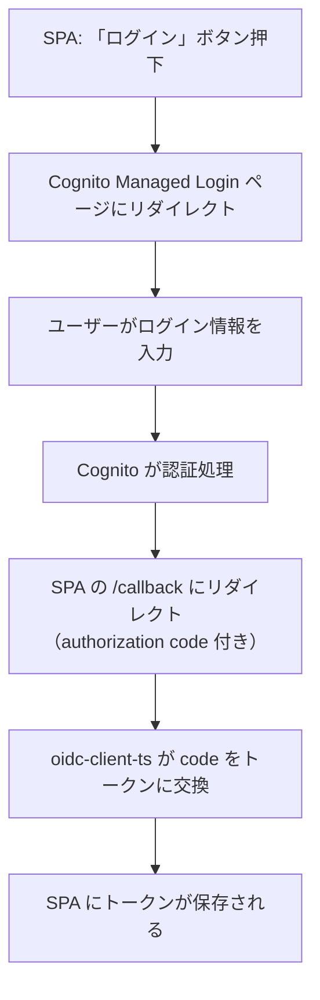
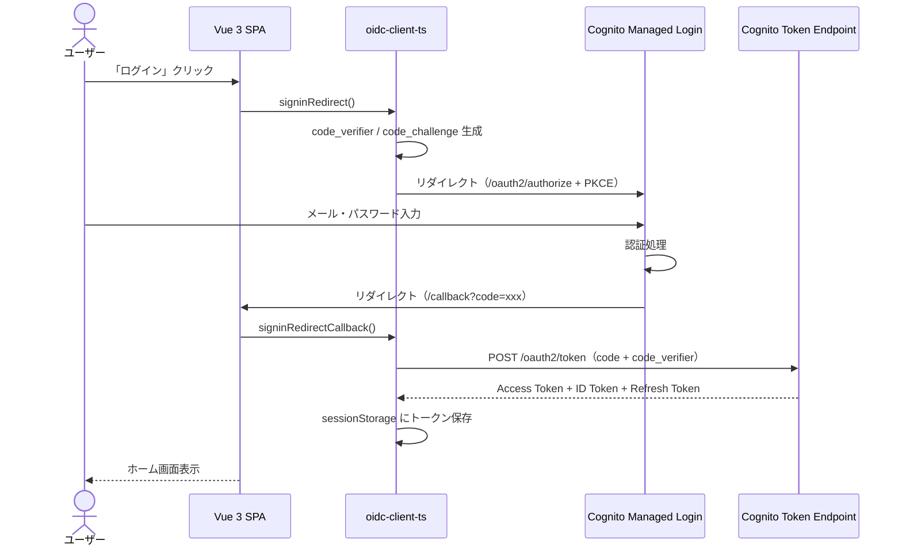
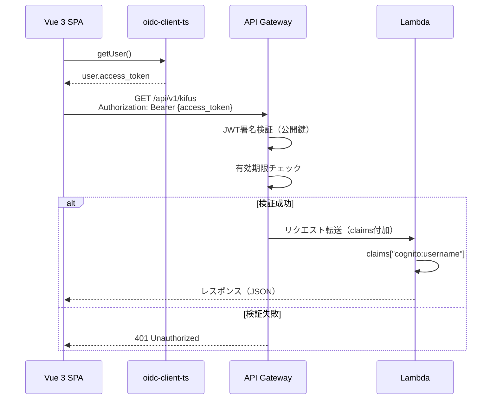
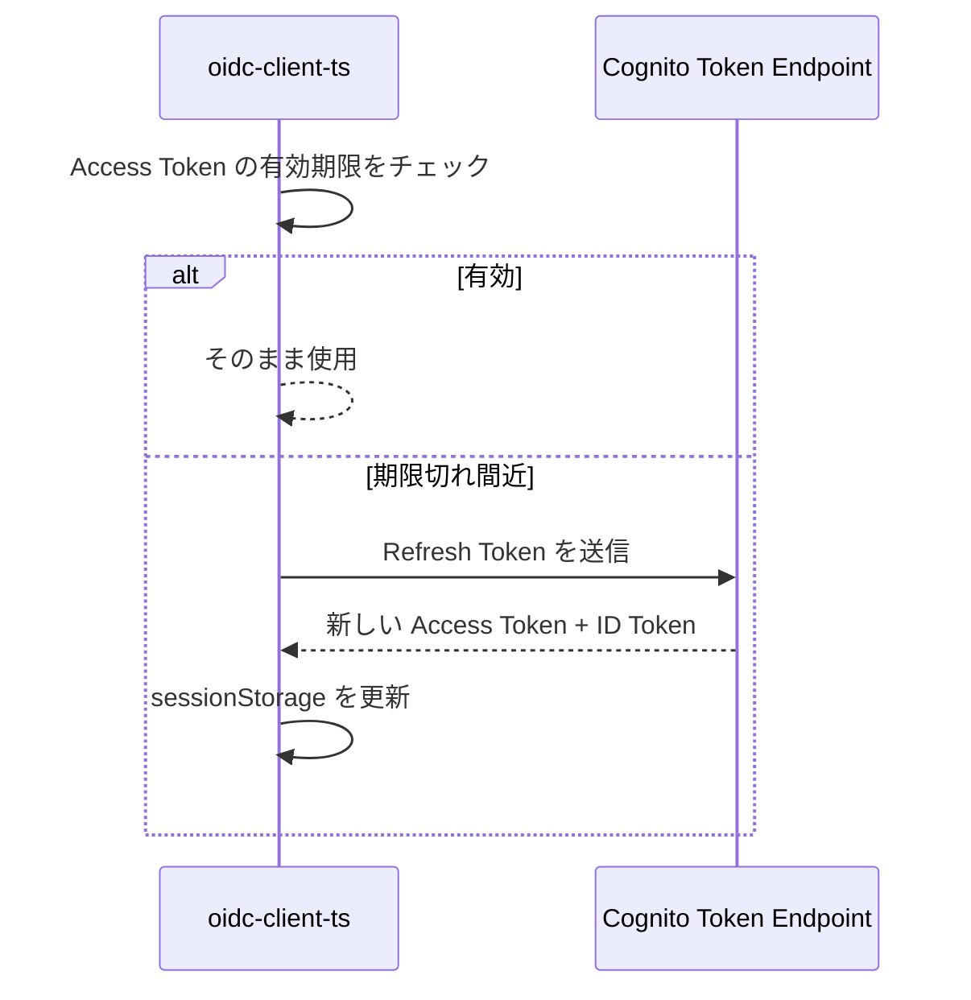
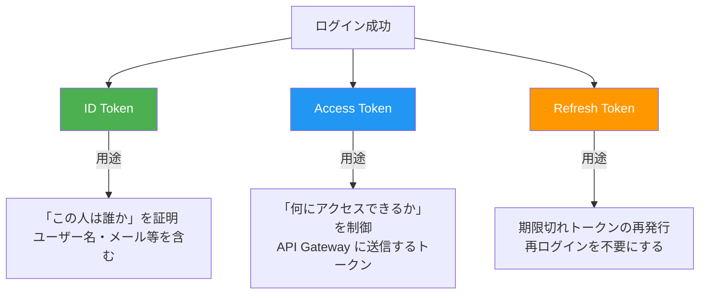
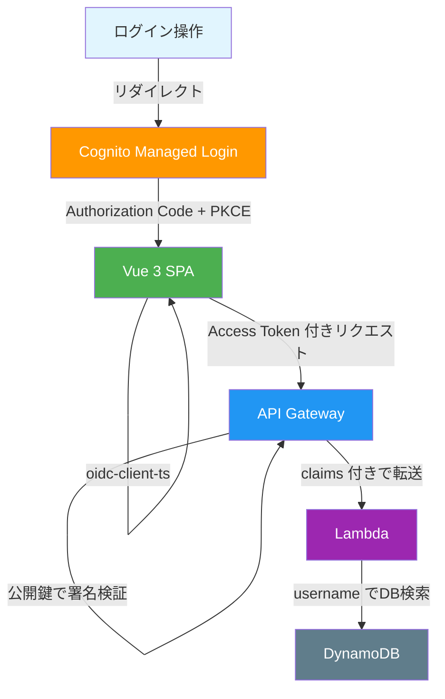

# Cognito Managed Login + oidc-client-ts 認証ガイド

本アプリ（Vue 3 SPA + Lambda + API Gateway）で採用する認証方式の解説。

> 旧版（Amplify SDK ベース）は [old/cognito-auth-guide.md](old/cognito-auth-guide.md) を参照。

---

## 1. なぜこの認証方式なのか

旧システム（SSR）ではサーバー側でログイン処理からセッション管理まですべて行っていた。
SPA（Single Page Application）では**フロントエンドとバックエンドが完全に分離**されるため、認証の仕組みが変わる。

```mermaid
graph LR
  subgraph 旧システム（SSR）
    A[ブラウザ] -->|ログインフォーム送信| B[Lambda]
    B -->|Cognito認証| C[Cognito]
    B -->|セッションCookie発行| A
    A -->|Cookie付きリクエスト| B
  end
```

```mermaid
graph LR
  subgraph 新システム（SPA + Managed Login）
    A[Vue 3 SPA] -->|リダイレクト| ML[Cognito Managed Login]
    ML -->|認証完了| A
    A -->|トークン付きAPIリクエスト| B[API Gateway + Lambda]
    B -->|トークン検証| B
  end
```

**ポイント**:
- 新システムではログイン画面をSPA内に作らない
- Cognitoが提供する **Managed Login ページ** にリダイレクトし、認証完了後にSPAに戻る
- **oidc-client-ts** がトークン管理を担当する（Amplify SDKは使用しない）

---

## 2. Managed Login とは

Cognito Managed Login は、Cognitoが提供するフルマネージドのログイン画面。



### Managed Login が処理すること

| 操作 | Managed Login | SPA側の実装 |
|------|:---:|:---:|
| サインアップ | ○ | 不要 |
| ログイン | ○ | 不要 |
| メール確認 | ○ | 不要 |
| パスワードリセット | ○ | 不要 |
| パスワード変更 | ○ | 不要 |
| MFA | ○ | 不要 |
| ログアウト | - | oidc-client-ts で処理 |
| プロフィール編集 | - | SPA で独自実装 |

---

## 3. 認証フロー（Authorization Code + PKCE）

### 3.1 ログイン



### 3.2 API呼出（認証済みリクエスト）



### 3.3 トークン自動更新

oidc-client-ts の `automaticSilentRenew` を有効にすると、Access Token の期限切れ前に Refresh Token で自動更新される。



---

## 4. トークンの保管場所

### なぜ sessionStorage なのか

| 保管方法 | 特徴 |
|---------|------|
| **sessionStorage（採用）** | タブを閉じると消える。XSSで読まれるリスクはあるが、影響がタブ単位に限定される |
| localStorage | リロードしても残る。XSSで盗まれた場合、別タブ・別セッションからも使える |
| Cookie (HttpOnly) | JSからアクセス不可でXSSに強い。ただしCSRF対策が必要で、追加実装コストが高い |

**sessionStorage を選ぶ理由:**

1. **タブを閉じればトークンが消える** — 共有PCでの意図しないセッション残留を防ぐ
2. **oidc-client-ts のデフォルト設定** でそのまま使える
3. **アプリの性質** — 棋譜管理アプリであり、金融・医療ほどの高セキュリティ要件ではない
4. **XSS自体を防ぐ** — Vueの自動エスケープ、CSPヘッダー等で根本対策を行う

> 詳細な比較は [old/why-localstorage.md](old/why-localstorage.md) も参照（localStorage版の検討経緯）。

---

## 5. Cognitoが発行する3つのトークン

ログインが成功すると、Cognitoは**3種類のトークン**を発行する。



### 各トークンの比較

| | ID Token | Access Token | Refresh Token |
|---|---|---|---|
| **中身** | ユーザー情報（名前、メール等） | アクセス権限（スコープ） | 暗号化済み（中身は見えない） |
| **有効期限** | 1時間（デフォルト） | 1時間（デフォルト） | 30日（デフォルト） |
| **本アプリでの用途** | ユーザー情報の表示 | **API呼出時にヘッダーに付与** | トークン自動更新 |
| **形式** | JWT（デコード可能） | JWT（デコード可能） | 暗号化文字列 |

### 本アプリでは「Access Token」をAPIに送る

oidc-client-ts + OIDC標準フローでは、**Access Token** を `Authorization: Bearer` ヘッダーに付与してAPIを呼び出す。

---

## 6. JWTトークンの中身

Access Token は「JWT」（JSON Web Token）という形式。3つのパートがドット（`.`）で繋がった文字列。

### ペイロード（中身）の例

```json
{
  "sub": "a1b2c3d4-e5f6-7890-abcd-ef1234567890",
  "cognito:username": "hakira",
  "token_use": "access",
  "scope": "openid email profile",
  "iss": "https://cognito-idp.ap-northeast-1.amazonaws.com/ap-northeast-1_XXXXX",
  "client_id": "1234567890abcdefghijklmnop",
  "exp": 1737543600,
  "iat": 1737540000
}
```

### API Gatewayの検証内容

API Gatewayは以下を確認してから、Lambdaにリクエストを転送する：

1. **署名の正当性**: Cognitoの公開鍵（JWKS）で署名を検証 → 改ざんされていないか
2. **有効期限**: `exp` が現在時刻より未来か → 期限切れではないか
3. **発行者**: `iss` が正しいCognitoユーザープールか → 偽のトークンではないか
4. **対象**: `client_id` が正しいアプリクライアントIDか → 別アプリのトークンではないか

---

## 7. Lambdaでのユーザー特定

API Gatewayが検証を通過すると、トークンの中身（claims）がLambdaのイベントに付加される。

```python
def lambda_handler(event, context):
    # API Gatewayが付加したユーザー情報を取得
    claims = event["requestContext"]["authorizer"]["claims"]

    username = claims["cognito:username"]  # → "hakira"

    # このusernameでDynamoDBを検索
    # pk = f"kifu#uname#{username}"
```

**Lambda側でトークンの検証処理を書く必要はない**。API Gatewayがすべて行ってくれる。

---

## 8. フロントエンド実装の全体像

### oidc-client-ts のセットアップ

```typescript
import { UserManager, WebStorageStateStore } from 'oidc-client-ts'

const userManager = new UserManager({
  authority: 'https://cognito-idp.{region}.amazonaws.com/{userPoolId}',
  client_id: '{appClientId}',
  redirect_uri: '{origin}/callback',
  post_logout_redirect_uri: '{origin}/',
  response_type: 'code',
  scope: 'openid email profile',
  userStore: new WebStorageStateStore({ store: window.sessionStorage }),
  metadata: {
    end_session_endpoint:
      'https://{domain}.auth.{region}.amazoncognito.com/logout',
  },
})
```

### 認証操作の対応表

| 画面 | 処理場所 | Lambda API |
|------|----------|------------|
| サインアップ | Cognito Managed Login | **不要** |
| メール確認 | Cognito Managed Login | **不要** |
| ログイン | Cognito Managed Login | **不要** |
| ログアウト | oidc-client-ts | **不要** |
| パスワード変更 | Cognito Managed Login | **不要** |
| パスワードリセット | Cognito Managed Login | **不要** |
| プロフィール表示 | - | `GET /api/v1/users/me` |
| アカウント削除 | - | `DELETE /api/v1/users/me` |

**認証操作のほとんどは Managed Login で完結し、Lambda APIは不要。**

### API呼出の共通パターン

```typescript
async function apiRequest(method: string, path: string, body?: object) {
  const user = await userManager.getUser()

  if (!user || user.expired) {
    // トークンがない or 期限切れ → Managed Login へリダイレクト
    await userManager.signinRedirect()
    return
  }

  const response = await fetch(`${API_BASE_URL}${path}`, {
    method,
    headers: {
      'Authorization': `Bearer ${user.access_token}`,
      'Content-Type': 'application/json',
    },
    body: body ? JSON.stringify(body) : undefined,
  })

  if (response.status === 401) {
    // トークンが無効 → 再認証
    await userManager.signinRedirect()
    return
  }

  return response.json()
}
```

---

## 9. まとめ：認証で覚えておくこと



| 役割 | 担当 | 開発者がやること |
|------|------|----------------|
| ログイン/登録 | Cognito Managed Login | リダイレクト先を設定するだけ |
| トークン管理 | oidc-client-ts | UserManager を設定するだけ |
| トークン検証 | API Gateway | SAMテンプレートで設定するだけ |
| ユーザー特定 | Lambda | `claims["cognito:username"]` を読むだけ |
