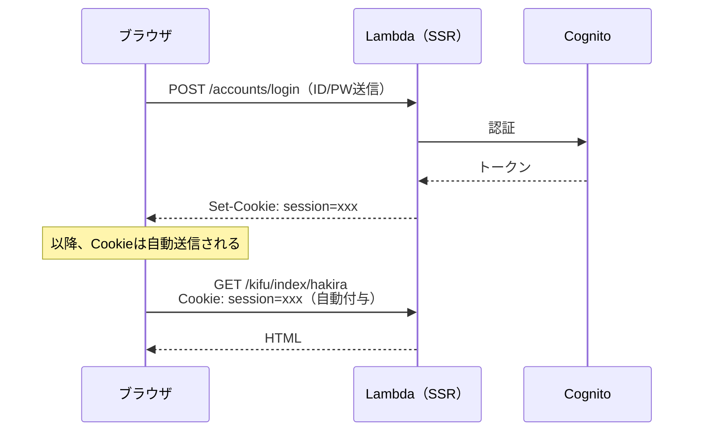
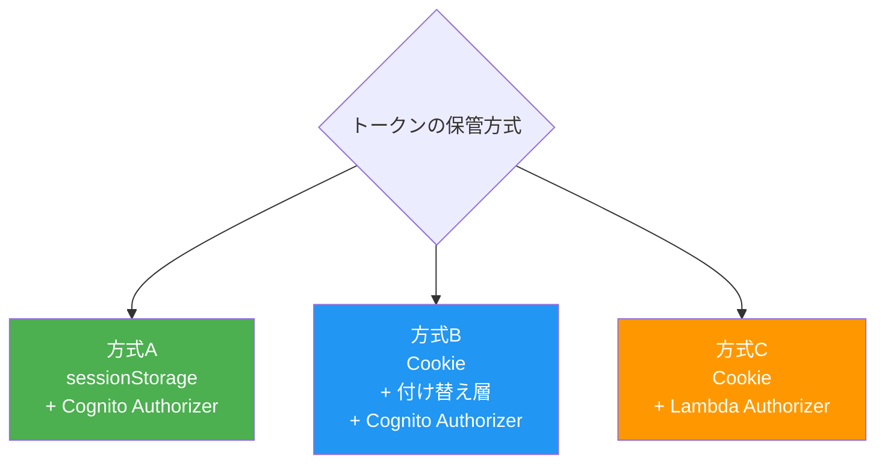
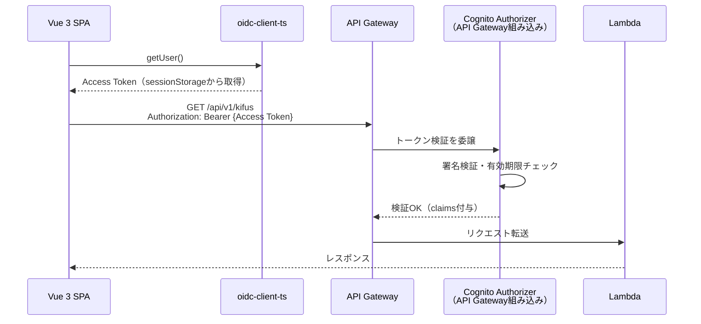
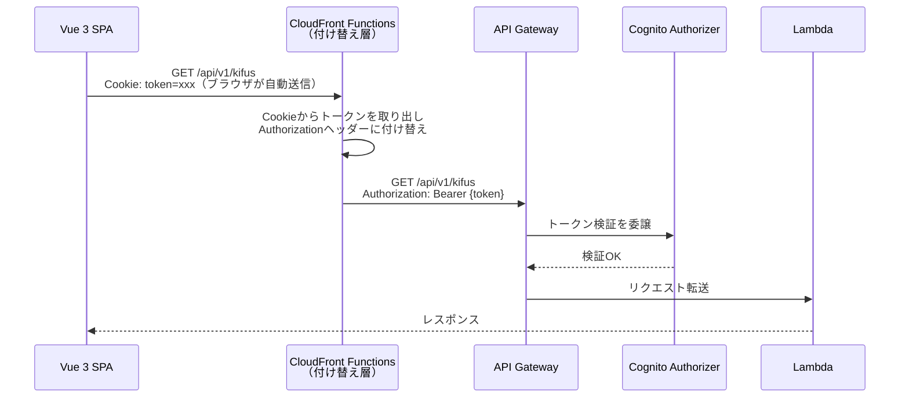
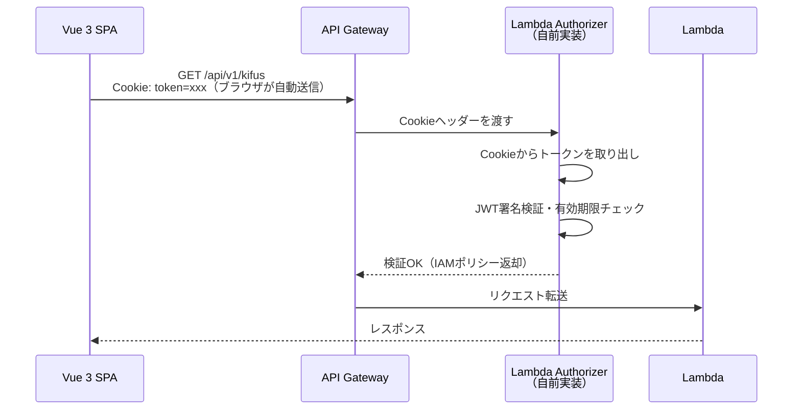
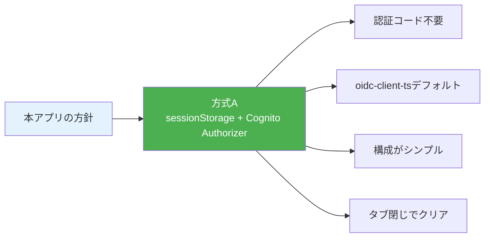

# なぜsessionStorageを使うのか（Cookie vs localStorage vs sessionStorage）

旧システムではCookieでセッション管理していたが、新システムではsessionStorageを採用する。
その理由を解説する。

> 旧版（localStorage採用時の検討経緯）は [old/why-localstorage.md](old/why-localstorage.md) を参照。

---

## 1. 旧システム（SSR + Cookie）の仕組み

旧システムでは、ブラウザとLambdaが**同じオリジン**で動作していた。

**Cookieの利点**: ブラウザが自動で毎回送信してくれるので、開発者がトークン管理を意識する必要がない。

---

## 2. 新システムでの3つの選択肢

SPAからAPIを呼ぶとき、トークンの保管場所と検証方式で主に3つの方式がある。

---

### 方式A: sessionStorage + Cognito Authorizer（採用）

- **oidc-client-ts** のデフォルト設定でそのまま使える
- タブを閉じるとトークンが消える（意図しないセッション残留を防止）
- **設定だけで動く**（追加の認証コード不要）

---

### 方式B: Cookie + 付け替え層 + Cognito Authorizer

- HttpOnly属性でXSSに強い
- **Cognito Authorizerをそのまま使える**
- ただし付け替え層（CloudFront Functions等）の追加実装が必要
- CSRF対策も別途必要

---

### 方式C: Cookie + Lambda Authorizer

- **Lambda Authorizer** でCookieからのトークン取得とJWT検証をまとめて行う
- 本番システムでも広く使われている実績あるパターン
- ただしAuthorizer Lambdaの実装・管理が必要

---

## 3. 比較

いずれも実用的な方式であり、要件に応じた選択になる。

| 観点 | 方式A: sessionStorage | 方式B: Cookie+付け替え | 方式C: Cookie+Lambda Auth |
|------|--------------------|-----------------------|--------------------------|
| トークン保管 | sessionStorage | Cookie（HttpOnly） | Cookie（HttpOnly） |
| XSSリスク | JSから読める | HttpOnlyなら読めない | HttpOnlyなら読めない |
| CSRF対策 | 不要 | 必要 | 必要 |
| API Gateway検証 | Cognito Authorizer | Cognito Authorizer | Lambda Authorizer |
| 追加実装 | なし | 付け替え層 | Authorizer Lambda |
| oidc-client-ts | デフォルト動作 | カスタム設定が必要 | カスタム設定が必要 |
| タブ間共有 | 不可（タブ独立） | 可能 | 可能 |
| タブ閉じ時 | 消える | 残る（expiry設定次第） | 残る |
| 運用コスト | 最小 | CF Functionsの管理 | Authorizer Lambdaの管理 |

**どの方式が優れているという話ではなく、トレードオフの関係にある。**

---

## 4. 本アプリでは方式A（sessionStorage）を選ぶ理由

本アプリでは**シンプルさを優先して方式Aを採用する**。

### 理由1: 認証まわりの実装量を最小にしたい

| 方式 | 追加で実装・管理するもの |
|------|----------------------|
| 方式B | CloudFront Functions等の付け替え層、CSRF対策、Cookieの設定管理 |
| 方式C | Lambda Authorizer（JWT検証ロジック、JWKS公開鍵取得・キャッシュ）、CSRF対策 |
| **方式A** | **なし（SAMテンプレートの設定のみ）** |

### 理由2: oidc-client-ts のデフォルトに乗れる

oidc-client-ts はデフォルトで sessionStorage にトークンを保存し、
`getUser()` で取り出して Authorization ヘッダーに付与するフローを想定している。
この標準的な流れをそのまま使える。

### 理由3: タブを閉じるとセッションが消える

sessionStorage はタブを閉じると自動的にクリアされる。
共有PCでブラウザを閉じ忘れた場合でも、localStorage より安全。

### 理由4: XSSリスクは実用上許容できる

sessionStorage の弱点はXSS攻撃時のトークン漏洩だが、以下の理由で許容範囲と判断する：

1. **トークンは短命（1時間）** — 盗まれても1時間で無効になる
2. **Refresh Tokenの無効化が可能** — CognitoのRevoke機能で即座に取り消せる
3. **影響範囲がタブ単位** — localStorageと異なり、他のタブには影響しない
4. **アプリの性質** — 棋譜管理アプリであり、金融・医療のような高セキュリティ要件ではない
5. **XSS自体を防ぐ** — Vueの自動エスケープ、CSPヘッダー等で根本対策を行う

---

## 5. まとめ

| 判断ポイント | 結論 |
|-------------|------|
| 方式B・Cはダメなのか？ | いいえ。いずれも本番で広く使われている実績ある方式 |
| なぜ方式Aを選ぶのか？ | 認証の実装量を最小にし、oidc-client-tsのデフォルトに乗れるシンプルさを優先 |
| XSSリスクは大丈夫か？ | トークン短命 + タブ単位 + Vue自動エスケープ + CSPで実用上十分 |
| localStorageではなくsessionStorageなのは？ | タブ閉じ時のクリア、oidc-client-tsのデフォルト |
