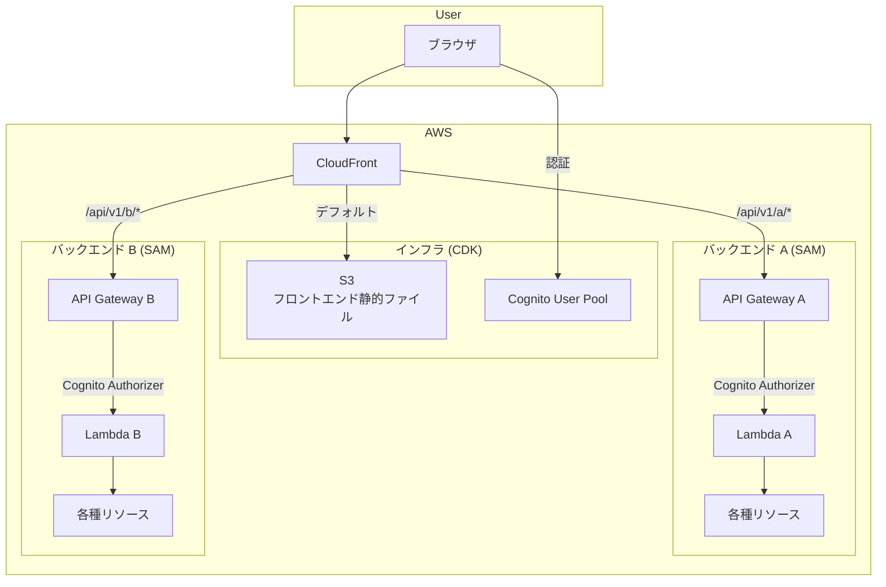
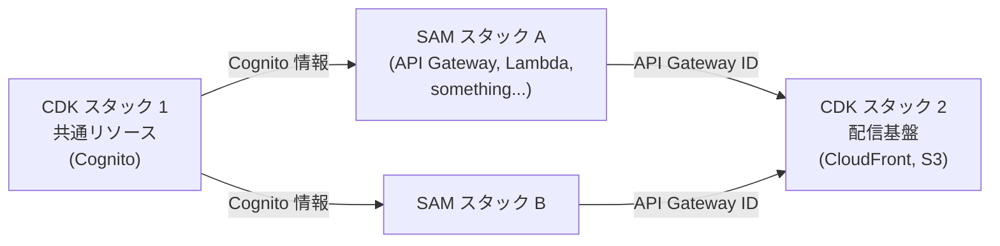
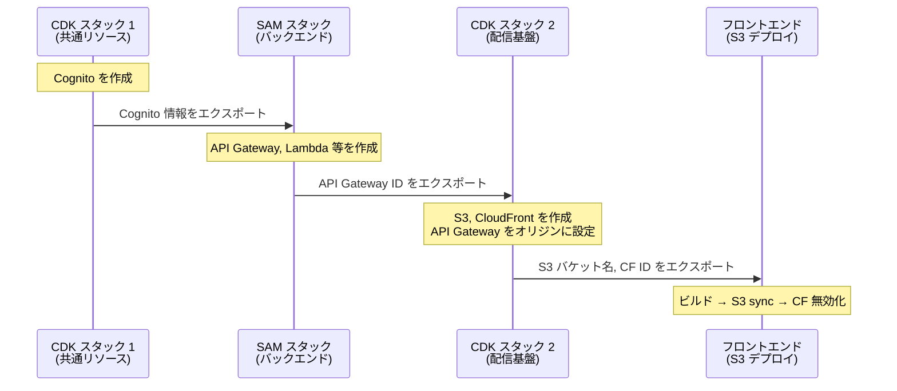

# システムアーキテクチャ — レイヤーの責務

## 概要

本ドキュメントは、フロントエンド・バックエンド・インフラ・CI/CD の各レイヤーの責務を明確化する。

レイヤー間の結合仕様（契約）については [units_contracts.md](units_contracts.md) を参照。

バックエンドの内部設計（データストアの選定、API エンドポイント定義等）は本ドキュメントのスコープ外とする。

## 全体構成図

---

## レイヤーの責務

### フロントエンド

| 項目 | 内容 |
|------|------|
| 技術スタック | Vue 3 SPA |
| 管理ディレクトリ | `Frontend/` |
| IaC | なし（ビルド成果物を S3 にデプロイ） |
| 責務 | UI の構築、ユーザー操作の処理、API 呼び出し |

フロントエンドはビルド成果物（静的ファイル）を生成するのみであり、AWS リソースの管理は行わない。

### バックエンド

| 項目 | 内容 |
|------|------|
| 技術スタック | API Gateway + Lambda |
| 管理ディレクトリ | `Backend/`（マイクロサービスごとに分かれうる） |
| IaC | SAM (`template.yaml`) |
| 責務 | API の提供、ビジネスロジックの実行、データストアの管理 |

バックエンドはマイクロサービスアーキテクチャを採用し、以下の原則に従う。

- **各マイクロサービスはリソースを共有しない**: データストア等のリソースは各 SAM スタック内で定義・管理する
- **各マイクロサービスは独立してデプロイ可能**: 他のマイクロサービスに影響を与えずにデプロイできる
- **唯一の共有リソースは Cognito**: 各バックエンドの API Gateway には Cognito Authorizer が必要であり、全マイクロサービスが同一の Cognito User Pool を参照する。そのため Cognito は共通インフラとして CDK で作成し、各 SAM スタックに情報を渡す

### インフラ

| 項目 | 内容 |
|------|------|
| 技術スタック | CloudFront, S3, Cognito |
| 管理ディレクトリ | `Infra/` |
| IaC | CDK |
| 責務 | 認証基盤の提供、フロントエンド配信、バックエンドへのルーティング |

インフラは全レイヤーに共通する基盤のみを管理する。バックエンド固有のリソースは管理しない。

### CI/CD

| 項目 | 内容 |
|------|------|
| 技術スタック | CodeBuild + GitHub 連携 |
| 管理ディレクトリ | `CICD/` |
| IaC | CloudFormation（素の YAML） |
| 責務 | 各レイヤーのビルドとデプロイの自動化 |

CI/CD は環境（インフラ・バックエンド等）とは独立して構築できる必要があるため、環境構築不要の素の CloudFormation で定義する（CDK や SAM に依存しない）。

- **CodeBuild プロジェクト**: フロントエンド・バックエンド・インフラそれぞれに対応する CodeBuild プロジェクトを CloudFormation で作成する
- **buildspec.yml**: 各リポジトリ（フロントエンド・バックエンド・インフラ）のルートに `buildspec.yml` を配置し、ビルド・デプロイ手順を定義する
- **GitHub 連携**: CodeBuild が GitHub リポジトリの変更を検知してビルドを実行する

---

## スタック構成とデプロイ順序

インフラ（CDK）とバックエンド（SAM）の間に循環依存が発生しないよう、CDK を 2 つのスタックに分割する。

| デプロイ順 | スタック | 管理ツール | 作成するリソース |
|----------|---------|----------|----------------|
| 1 | 共通リソーススタック | CDK | Cognito |
| 2 | バックエンドスタック（各マイクロサービス） | SAM | API Gateway, Lambda, その他バックエンド固有リソース |
| 3 | 配信基盤スタック | CDK | S3, CloudFront |

### 初回デプロイフロー

### 2 回目以降のデプロイ

変更のあるレイヤーのみを個別にデプロイできる。

| 変更対象 | デプロイ対象 | 備考 |
|---------|------------|------|
| フロントエンドのみ | フロントエンド | S3 sync + CF 無効化 |
| 既存バックエンドのみ | 対象の SAM スタック | 他のスタックに影響なし |
| 新しいマイクロサービス追加 | 新 SAM スタック + CDK スタック 2 | 新 API Gateway を CloudFront に追加 |
| Cognito 設定変更 | CDK スタック 1 | エクスポート値が変わる場合は依存先も再デプロイ |
| CloudFront 設定変更 | CDK スタック 2 | ビヘイビアやオリジンの変更 |

---

## マイクロサービスの追加規約

新しいマイクロサービスを追加する際に従うべき規約を定める。

### SAM テンプレートの要件

1. **Cognito 情報の取得**: CDK 共通リソーススタックのエクスポートを `Fn::ImportValue` で参照する
2. **API Gateway ID のエクスポート**: `${prefix}-${service}-ApiGatewayId` と `${prefix}-${service}-ApiGatewayStageName` をエクスポートする
3. **リソースの自己完結**: バックエンド固有のリソースは SAM テンプレート内で定義する（他スタックのリソースを参照しない）

### CloudFront ビヘイビアの登録

CDK 配信基盤スタックに新しい API Gateway をオリジンとして追加し、パスパターンで振り分ける。

| パターン | 割り当て |
|---------|---------|
| `/` (デフォルト) | S3（フロントエンド） |
| `/api/v1/a/*` | バックエンド A |
| `/api/v1/b/*` | バックエンド B |
